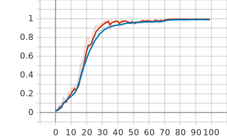
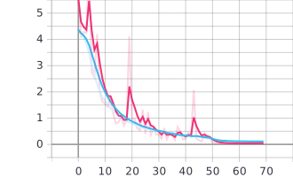

# 1. 数据目录结构
```
[1-92]                                  # 人员标签
    ├── multi/                          # 多光谱
    │   └── illum[1-3]/, normal/        # 干扰 `1-3`，无干扰
    │       ├── Multi_[1-7]_W1_1/       # 位置 `1-7`        无眼镜      每个位置目录下包括四个照片目录
    │       │   └── [1-4]/              #                              每个目录下包括25张图片文件
    │       │       └── [1-25].jpg
    │       ├── Multi_4_W1_6            # 位置 `4`          墨镜        目录下包括四个照片目录
    │       │   └── [1-4]/              #                              每个目录下包括25张图片文件
    │       │       └── [1-25].jpg
    │       └── Multi_[1-7]_W1_5        # 位置 `1-7`        眼镜        每个目录下包括25张图片文件， 部分人员无眼镜，即无该目录
    │           └── [1-25].jpg        
    └── rgb                             # 可见光
        └── illum[1-3]/, normal/        # 干扰 `1-3`，无干扰
            ├── RGB_[1-7]_W1_1/         # 位置 `1-7`        无眼镜      每个位置目录下包括四张照片文件
            │   └── [1-4].jpg
            ├── RGB_4_W1_6/             # 位置 `4`          墨镜        目录下包括四张照片文件
            │   └── [1-4].jpg
            └── RGB_[1-7]_W1_5.jpg      # 位置 `1-7`        眼镜        部分人员无眼镜，即无该图片
```

# 2. 实验

首先进行试验，确定合适的`configer`参数，在此基础上进行实验，在配置文件`config.py`中保存的参数下，获得良好的实验结果




```
dsize = (112//2, 96//2)
```

## 3.1 划分比例的确定

> 确定在何种划分下进行实验，后续实验均以此结果为标准。

- 划分方式与上阶段一致，在每人的数据中，保留`Multi`与`RGB`同时检测出的图片路径，打乱后按一定比例划分；
- 本次实验划分时不做特殊处理，若需要其中指定条件的数据，可在`RecognizeDataset`中指定筛选条件`condition`；

运行
``` python
python gen_split.py

[split_112x96_[0.10:0.70:0.20]_[1]] n_items: 3796, n_train: 365, n_valid: 2633, n_test: 798, ratio: 0.096: 0.694: 0.210
[split_112x96_[0.10:0.70:0.20]_[2]] n_items: 3796, n_train: 365, n_valid: 2633, n_test: 798, ratio: 0.096: 0.694: 0.210
[split_112x96_[0.10:0.70:0.20]_[3]] n_items: 3796, n_train: 365, n_valid: 2633, n_test: 798, ratio: 0.096: 0.694: 0.210
[split_112x96_[0.10:0.70:0.20]_[4]] n_items: 3796, n_train: 365, n_valid: 2633, n_test: 798, ratio: 0.096: 0.694: 0.210
[split_112x96_[0.10:0.70:0.20]_[5]] n_items: 3796, n_train: 365, n_valid: 2633, n_test: 798, ratio: 0.096: 0.694: 0.210
[split_112x96_[0.20:0.60:0.20]_[1]] n_items: 3796, n_train: 735, n_valid: 2263, n_test: 798, ratio: 0.194: 0.596: 0.210
[split_112x96_[0.20:0.60:0.20]_[2]] n_items: 3796, n_train: 735, n_valid: 2263, n_test: 798, ratio: 0.194: 0.596: 0.210
[split_112x96_[0.20:0.60:0.20]_[3]] n_items: 3796, n_train: 735, n_valid: 2263, n_test: 798, ratio: 0.194: 0.596: 0.210
[split_112x96_[0.20:0.60:0.20]_[4]] n_items: 3796, n_train: 735, n_valid: 2263, n_test: 798, ratio: 0.194: 0.596: 0.210
[split_112x96_[0.20:0.60:0.20]_[5]] n_items: 3796, n_train: 735, n_valid: 2263, n_test: 798, ratio: 0.194: 0.596: 0.210
[split_112x96_[0.30:0.50:0.20]_[1]] n_items: 3796, n_train: 1104, n_valid: 1895, n_test: 797, ratio: 0.291: 0.499: 0.210
[split_112x96_[0.30:0.50:0.20]_[2]] n_items: 3796, n_train: 1104, n_valid: 1895, n_test: 797, ratio: 0.291: 0.499: 0.210
[split_112x96_[0.30:0.50:0.20]_[3]] n_items: 3796, n_train: 1104, n_valid: 1895, n_test: 797, ratio: 0.291: 0.499: 0.210
[split_112x96_[0.30:0.50:0.20]_[4]] n_items: 3796, n_train: 1104, n_valid: 1895, n_test: 797, ratio: 0.291: 0.499: 0.210
[split_112x96_[0.30:0.50:0.20]_[5]] n_items: 3796, n_train: 1104, n_valid: 1895, n_test: 797, ratio: 0.291: 0.499: 0.210
[split_112x96_[0.40:0.40:0.20]_[1]] n_items: 3796, n_train: 1474, n_valid: 1474, n_test: 848, ratio: 0.388: 0.388: 0.223
[split_112x96_[0.40:0.40:0.20]_[2]] n_items: 3796, n_train: 1474, n_valid: 1474, n_test: 848, ratio: 0.388: 0.388: 0.223
[split_112x96_[0.40:0.40:0.20]_[3]] n_items: 3796, n_train: 1474, n_valid: 1474, n_test: 848, ratio: 0.388: 0.388: 0.223
[split_112x96_[0.40:0.40:0.20]_[4]] n_items: 3796, n_train: 1474, n_valid: 1474, n_test: 848, ratio: 0.388: 0.388: 0.223
[split_112x96_[0.40:0.40:0.20]_[5]] n_items: 3796, n_train: 1474, n_valid: 1474, n_test: 848, ratio: 0.388: 0.388: 0.223
[split_112x96_[0.50:0.30:0.20]_[1]] n_items: 3796, n_train: 1895, n_valid: 1104, n_test: 797, ratio: 0.499: 0.291: 0.210
[split_112x96_[0.50:0.30:0.20]_[2]] n_items: 3796, n_train: 1895, n_valid: 1104, n_test: 797, ratio: 0.499: 0.291: 0.210
[split_112x96_[0.50:0.30:0.20]_[3]] n_items: 3796, n_train: 1895, n_valid: 1104, n_test: 797, ratio: 0.499: 0.291: 0.210
[split_112x96_[0.50:0.30:0.20]_[4]] n_items: 3796, n_train: 1895, n_valid: 1104, n_test: 797, ratio: 0.499: 0.291: 0.210
[split_112x96_[0.50:0.30:0.20]_[5]] n_items: 3796, n_train: 1895, n_valid: 1104, n_test: 797, ratio: 0.499: 0.291: 0.210
[split_112x96_[0.60:0.20:0.20]_[1]] n_items: 3796, n_train: 2263, n_valid: 704, n_test: 829, ratio: 0.596: 0.185: 0.218
[split_112x96_[0.60:0.20:0.20]_[2]] n_items: 3796, n_train: 2263, n_valid: 704, n_test: 829, ratio: 0.596: 0.185: 0.218
[split_112x96_[0.60:0.20:0.20]_[3]] n_items: 3796, n_train: 2263, n_valid: 704, n_test: 829, ratio: 0.596: 0.185: 0.218
[split_112x96_[0.60:0.20:0.20]_[4]] n_items: 3796, n_train: 2263, n_valid: 704, n_test: 829, ratio: 0.596: 0.185: 0.218
[split_112x96_[0.60:0.20:0.20]_[5]] n_items: 3796, n_train: 2263, n_valid: 704, n_test: 829, ratio: 0.596: 0.185: 0.218
[split_112x96_[0.70:0.10:0.20]_[1]] n_items: 3796, n_train: 2633, n_valid: 334, n_test: 829, ratio: 0.694: 0.088: 0.218
[split_112x96_[0.70:0.10:0.20]_[2]] n_items: 3796, n_train: 2633, n_valid: 334, n_test: 829, ratio: 0.694: 0.088: 0.218
[split_112x96_[0.70:0.10:0.20]_[3]] n_items: 3796, n_train: 2633, n_valid: 334, n_test: 829, ratio: 0.694: 0.088: 0.218
[split_112x96_[0.70:0.10:0.20]_[4]] n_items: 3796, n_train: 2633, n_valid: 334, n_test: 829, ratio: 0.694: 0.088: 0.218
[split_112x96_[0.70:0.10:0.20]_[5]] n_items: 3796, n_train: 2633, n_valid: 334, n_test: 829, ratio: 0.694: 0.088: 0.218
```

在当前目录下，生成文件夹`split`，其目录结构如下
```
split
└── split_112x96_[比例]_[划分计数]
    ├── note.txt
    ├── test_Multi.txt
    ├── test_RGB.txt
    ├── train_Multi.txt
    ├── train_RGB.txt
    ├── valid_Multi.txt
    └── valid_RGB.txt
```

其中比例形式为`训练集：验证集：测试集`，划分计数为1~5。

- 各比例下进行5次随机划分，依次在比例为以下情况时进行实验；
- 统计各情况下5次准确率、损失值，并计算均值；
- 做出曲线；

``` shell
cd Ecust/louishsu/recognize_stage_2
python
>>> from main_update_config import main_3_1
>>> main_3_1()      # 训练、测试
>>> main_3_1(True)  # 输出文件到`images`
```

### Multi

准确率：
| count/比例 | 0.10: 0.70: 0.2 | 0.20: 0.60: 0.2 | 0.30: 0.50: 0.2 | 0.40: 0.40: 0.2 | 0.50: 0.30: 0.2 | 0.60: 0.20: 0.2 | 0.70: 0.10: 0.2 |
| --------: | ---------------: | ---------------: | ---------------: | ---------------: | ---------------: | ---------------: | ---------------: |
| 1 | 0.2149619311094284 | 0.8771556615829468 | 0.9566406011581421 | 0.9844896197319031 | 0.990234375 | 0.9869298934936523 | 0.994921863079071 |
| 2 | 0.20664063096046448 | 0.8104456067085266 | 0.9422104954719543 | 0.989062488079071 | 0.9906250238418579 | 0.9917968511581421 | 0.994140625 |
| 3 | 0.18599659204483032 | 0.9633825421333313 | 0.9828125238418579 | 0.979802131652832 | 0.9844209551811218 | 0.9945312738418579 | 0.9964548349380493 |
| 4 | 0.21216189861297607 | 0.7828124761581421 | 0.958984375 | 0.9877291917800903 | 0.9937499761581421 | 0.9948021769523621 | 0.9921283721923828 |
| 5 | 0.2265920341014862 | 0.8896991014480591 | 0.9828125238418579 | 0.9853854179382324 | 0.98828125 | 0.9952527284622192 | 0.9928801655769348 |
| average | 0.2092706173658371 | 0.8646990776062011 | 0.9646921038627625 | 0.9852937698364258 | 0.9894623160362244 | 0.9926625847816467 | 0.9941051721572876 |

损失值：
| count/比例 | 0.10: 0.70: 0.2 | 0.20: 0.60: 0.2 | 0.30: 0.50: 0.2 | 0.40: 0.40: 0.2 | 0.50: 0.30: 0.2 | 0.60: 0.20: 0.2 | 0.70: 0.10: 0.2 |
| --------: | ---------------: | ---------------: | ---------------: | ---------------: | ---------------: | ---------------: | ---------------: |
| 1 | 2.4846150875091553 | 0.5406866669654846 | 0.24240295588970184 | 0.08398889005184174 | 0.058236200362443924 | 0.06166341155767441 | 0.02826077677309513 |
| 2 | 2.491765022277832 | 0.7275170087814331 | 0.2726011872291565 | 0.08610193431377411 | 0.051581479609012604 | 0.04371415078639984 | 0.03160301595926285 |
| 3 | 2.616888999938965 | 0.2849043011665344 | 0.09661058336496353 | 0.1156279444694519 | 0.06800567358732224 | 0.029323657974600792 | 0.013814801350235939 |
| 4 | 2.54640531539917 | 0.7616688013076782 | 0.20859289169311523 | 0.08170180022716522 | 0.033651284873485565 | 0.034678198397159576 | 0.04227742925286293 |
| 5 | 2.4347915649414062 | 0.5256006717681885 | 0.0914262980222702 | 0.07377012819051743 | 0.0759594514966011 | 0.018698975443840027 | 0.033546604216098785 |
| average | 2.5148931980133056 | 0.5680754899978637 | 0.18232678323984147 | 0.08823813945055008 | 0.057486817985773084 | 0.03761567883193493 | 0.029900525510311127 |

作图如下


### RGB

准确率：
| count/比例 | 0.10: 0.70: 0.2 | 0.20: 0.60: 0.2 | 0.30: 0.50: 0.2 | 0.40: 0.40: 0.2 | 0.50: 0.30: 0.2 | 0.60: 0.20: 0.2 | 0.70: 0.10: 0.2 |
| --------: | ---------------: | ---------------: | ---------------: | ---------------: | ---------------: | ---------------: | ---------------: |
| 1 | 0.08554687350988388 | 0.671122670173645 | 0.8922334909439087 | 0.911442756652832 | 0.94140625 | 0.95027095079422 | 0.9545693397521973 |
| 2 | 0.15312500298023224 | 0.5469183921813965 | 0.890625 | 0.9198749661445618 | 0.936718761920929 | 0.953005313873291 | 0.957812488079071 |
| 3 | 0.2632812559604645 | 0.5569299459457397 | 0.8770450353622437 | 0.9144531488418579 | 0.954296886920929 | 0.9526745676994324 | 0.951953113079071 |
| 4 | 0.1308889091014862 | 0.6347512006759644 | 0.8611213564872742 | 0.7824583649635315 | 0.9387637972831726 | 0.9556798934936523 | 0.9530658721923828 |
| 5 | 0.13710936903953552 | 0.6986255645751953 | 0.8792968988418579 | 0.9253906011581421 | 0.9442325830459595 | 0.95613032579422 | 0.9624999761581421 |
| average | 0.15399028211832047 | 0.6216695547103882 | 0.8800643563270569 | 0.8907239675521851 | 0.943083655834198 | 0.9535522103309632 | 0.9559801578521728 |

损失值：
| count/比例 | 0.10: 0.70: 0.2 | 0.20: 0.60: 0.2 | 0.30: 0.50: 0.2 | 0.40: 0.40: 0.2 | 0.50: 0.30: 0.2 | 0.60: 0.20: 0.2 | 0.70: 0.10: 0.2 |
| --------: | ---------------: | ---------------: | ---------------: | ---------------: | ---------------: | ---------------: | ---------------: |
| 1 | 3.252647876739502 | 1.3402305841445923 | 0.6356235146522522 | 0.6834784746170044 | 0.30298250913619995 | 0.2781504988670349 | 0.2755158841609955 |
| 2 | 2.7481565475463867 | 1.6343910694122314 | 0.5718763470649719 | 0.45795875787734985 | 0.388595312833786 | 0.27012720704078674 | 0.255297988653183 |
| 3 | 2.497880458831787 | 1.5152888298034668 | 0.6399282217025757 | 0.47438138723373413 | 0.25746339559555054 | 0.28221434354782104 | 0.27349966764450073 |
| 4 | 2.7885241508483887 | 1.2938731908798218 | 0.8670710325241089 | 1.0074412822723389 | 0.32476240396499634 | 0.22587835788726807 | 0.29859524965286255 |
| 5 | 2.7365176677703857 | 1.3123371601104736 | 0.6363851428031921 | 0.5015788674354553 | 0.330943763256073 | 0.28889214992523193 | 0.2208179533481598 |
| average | 2.80474534034729 | 1.419224166870117 | 0.6701768517494202 | 0.6249677538871765 | 0.3209494769573212 | 0.2690525114536285 | 0.26474534869194033 |

作图如下


可知比例为`0.50: 0.30: 0.2`时，效果最佳。

## 3.2 波段对比实验

- 根据[实验3.1](#31-%e5%88%92%e5%88%86%e6%af%94%e4%be%8b%e7%9a%84%e7%a1%ae%e5%ae%9a)得到的最优划分，在5次随机划分进行实验；
- 依次选择单个波段的数据进行实验；
- 统计各情况下5次准确率、损失值，并计算均值；
- 做出曲线；

``` shell
cd Ecust/louishsu/recognize_stage_2
python
>>> from main_update_config import main_3_2
>>> main_3_2()      # 训练、测试
>>> main_3_2(True)  # 输出文件到`images`
```

### Multi

准确率：
| count/波段索引 | 1 | 2 | 3 | 4 | 5 | 6 | 7 | 8 | 9 | 10 | 11 | 12 | 13 | 14 | 15 | 16 | 17 | 18 | 19 | 20 | 21 | 22 | 23 | 24 | 25 |
| ----------: | -: | -: | -: | -: | -: | -: | -: | -: | -: | --: | --: | --: | --: | --: | --: | --: | --: | --: | --: | --: | --: | --: | --: | --: | --: |
| 1 | 0.9887 | 0.9863 | 0.9891 | 0.9898 | 0.9863 | 0.993 | 0.9899 | 0.9871 | 0.9867 | 0.9793000000000001 | 0.9863 | 0.9867 | 0.9895 | 0.9871 | 0.9902 | 0.9898 | 0.9902 | 0.9887 | 0.991 | 0.9926 | 0.9891 | 0.9836 | 0.9859 | 0.9883 | 0.9848 |
| 2 | 0.9903 | 0.9898 | 0.993 | 0.991 | 0.9859 | 0.9891 | 0.991 | 0.9918 | 0.9895 | 0.9898 | 0.9918 | 0.9856 | 0.9902 | 0.9887 | 0.9887 | 0.9902 | 0.9879000000000001 | 0.9836 | 0.9945 | 0.9895 | 0.9906 | 0.9937 | 0.9934000000000001 | 0.9937 | 0.9879000000000001 |
| 3 | 0.9914000000000001 | 0.9883 | 0.9865 | 0.9790000000000001 | 0.9915 | 0.9864 | 0.9879000000000001 | 0.9922 | 0.9883 | 0.9817 | 0.9861 | 0.9903 | 0.9884000000000001 | 0.9875 | 0.991 | 0.9922 | 0.9899 | 0.9821 | 0.9887 | 0.9911 | 0.9906999999999999 | 0.9902 | 0.993 | 0.9899 | 0.9849 |
| 4 | 0.9906 | 0.9871 | 0.9883 | 0.9887 | 0.9863 | 0.9848 | 0.9918 | 0.9926 | 0.9898 | 0.993 | 0.9887 | 0.9898 | 0.9883 | 0.9934000000000001 | 0.9843999999999999 | 0.9918 | 0.9871 | 0.9906 | 0.9914000000000001 | 0.9852 | 0.9922 | 0.9875 | 0.9934000000000001 | 0.9922 | 0.9875 |
| 5 | 0.9854999999999999 | 0.9836 | 0.9898 | 0.9887 | 0.9887 | 0.9840000000000001 | 0.9898 | 0.9852 | 0.9898 | 0.9883 | 0.9914000000000001 | 0.9879000000000001 | 0.9914000000000001 | 0.9887 | 0.9883 | 0.9867 | 0.9922 | 0.991 | 0.9871 | 0.9843999999999999 | 0.9859 | 0.9898 | 0.9871 | 0.9871 | 0.9914000000000001 |
| average | 0.9893000000000001 | 0.98702 | 0.98934 | 0.98744 | 0.98774 | 0.9874600000000001 | 0.9900800000000001 | 0.98978 | 0.9888199999999999 | 0.9864200000000001 | 0.9888600000000001 | 0.9880599999999999 | 0.9895600000000002 | 0.9890800000000001 | 0.98852 | 0.99014 | 0.98946 | 0.9872 | 0.99054 | 0.98856 | 0.9896999999999998 | 0.98896 | 0.99056 | 0.99024 | 0.9873000000000001 |

损失值：
| count/波段索引 | 1 | 2 | 3 | 4 | 5 | 6 | 7 | 8 | 9 | 10 | 11 | 12 | 13 | 14 | 15 | 16 | 17 | 18 | 19 | 20 | 21 | 22 | 23 | 24 | 25 |
| ----------: | -: | -: | -: | -: | -: | -: | -: | -: | -: | --: | --: | --: | --: | --: | --: | --: | --: | --: | --: | --: | --: | --: | --: | --: | --: |
| 1 | 0.0516 | 0.0541 | 0.0638 | 0.0478 | 0.0762 | 0.0264 | 0.0643 | 0.0619 | 0.0703 | 0.1034 | 0.0847 | 0.0693 | 0.0548 | 0.0722 | 0.0533 | 0.0613 | 0.0431 | 0.055 | 0.0346 | 0.0509 | 0.05 | 0.0805 | 0.0849 | 0.047 | 0.0744 |
| 2 | 0.0491 | 0.0606 | 0.0412 | 0.0649 | 0.06 | 0.056 | 0.0395 | 0.0391 | 0.0644 | 0.0483 | 0.0558 | 0.0795 | 0.0463 | 0.0577 | 0.0586 | 0.0661 | 0.0591 | 0.0956 | 0.0221 | 0.0517 | 0.0675 | 0.0317 | 0.047 | 0.0291 | 0.0628 |
| 3 | 0.0457 | 0.0671 | 0.1209 | 0.1393 | 0.0512 | 0.0729 | 0.0731 | 0.0612 | 0.078 | 0.0939 | 0.0692 | 0.0448 | 0.0655 | 0.073 | 0.0537 | 0.0575 | 0.0728 | 0.1082 | 0.0567 | 0.0536 | 0.0597 | 0.061 | 0.0629 | 0.069 | 0.0767 |
| 4 | 0.0518 | 0.0736 | 0.0646 | 0.0554 | 0.0784 | 0.0901 | 0.0464 | 0.0375 | 0.0513 | 0.0311 | 0.0495 | 0.0882 | 0.0531 | 0.0418 | 0.0785 | 0.0445 | 0.0796 | 0.0562 | 0.0444 | 0.072 | 0.0269 | 0.0603 | 0.0468 | 0.0432 | 0.0629 |
| 5 | 0.1029 | 0.0867 | 0.0688 | 0.0748 | 0.0636 | 0.0986 | 0.0693 | 0.0856 | 0.0589 | 0.0751 | 0.0368 | 0.0678 | 0.0537 | 0.0694 | 0.0484 | 0.0685 | 0.0577 | 0.0513 | 0.0744 | 0.0795 | 0.0711 | 0.0503 | 0.0731 | 0.0859 | 0.0655 |
| average | 0.060219999999999996 | 0.06842000000000001 | 0.07186 | 0.07644 | 0.06588 | 0.0688 | 0.058519999999999996 | 0.05706 | 0.06458 | 0.07036 | 0.059199999999999996 | 0.06992000000000001 | 0.05467999999999999 | 0.06282000000000001 | 0.058499999999999996 | 0.05958 | 0.06246 | 0.07326000000000002 | 0.046439999999999995 | 0.061540000000000004 | 0.05504 | 0.05676 |

作图如下


### RGB

准确率：
| count/波段索引 | R | G | B |
| ----------: | -: | -: | -: |
| 1 | 0.9227 | 0.9418000000000001 | 0.9262 |
| 2 | 0.9351999999999999 | 0.9223 | 0.9362999999999999 |
| 3 | 0.9254000000000001 | 0.9488 | 0.9370999999999999 |
| 4 | 0.9273 | 0.9161 | 0.9351999999999999 |
| 5 | 0.9398000000000001 | 0.9161 | 0.9223 |
| average | 0.93008 | 0.9290200000000001 | 0.9314199999999999 |

损失值：
| count/波段索引 | R | G | B |
| ----------: | -: | -: | -: |
| 1 | 0.4225 | 0.3349 | 0.3758 |
| 2 | 0.428 | 0.5199 | 0.3878 |
| 3 | 0.4294 | 0.3031 | 0.3737 |
| 4 | 0.4032 | 0.4461 | 0.3823 |
| 5 | 0.3114 | 0.4865 | 0.4001 |
| average | 0.3989 | 0.4181 | 0.38394000000000006 |

作图如下


根据图3.2.1.1，按准确率将波段排序，降序排序如下：
``` shell
Generating tables and figures [Multi]...
Best:  [23 19 24 16  7  8 21 13 17  3  1 14 22 11  9 20 15 12  5  6  4 25 18  2
 10]
Generating tables and figures [RGB]...
Best:  [3 1 2]
```

## 3.3 波段组合实验

> 该部分实验仅针对多光谱数据。

- 根据[实验3.1](#31-%e5%88%92%e5%88%86%e6%af%94%e4%be%8b%e7%9a%84%e7%a1%ae%e5%ae%9a)得到的最优划分，在5次随机划分进行实验；
- 根据[实验3.2](#32-%e6%b3%a2%e6%ae%b5%e5%af%b9%e6%af%94%e5%ae%9e%e9%aa%8c)得到的最优排序，依次选择最前1, 2, ..., 25个波段进行组合实验；
- 统计各情况下5次准确率、损失值，并计算均值；
- 做出曲线；


``` shell
cd Ecust/louishsu/recognize_stage_2
python
>>> from main_update_config import main_3_3
>>> main_3_3()      # 训练、测试
>>> main_3_3(True)  # 输出文件到`images`
```

准确率：
| count/组合数 | 1 | 2 | 3 | 4 | 5 | 6 | 7 | 8 | 9 | 10 | 11 | 12 | 13 | 14 | 15 | 16 | 17 | 18 | 19 | 20 | 21 | 22 | 23 | 24 | 25 |
| ---------: | -: | -: | -: | -: | -: | -: | -: | -: | -: | --: | --: | --: | --: | --: | --: | --: | --: | --: | --: | --: | --: | --: | --: | --: | --: |
| 1 | 0.9859 | 0.989453136920929 | 0.9886718988418579 | 0.98828125 | 0.9878906011581421 | 0.989453136920929 | 0.989062488079071 | 0.985156238079071 | 0.991406261920929 | 0.990234375 | 0.9867187738418579 | 0.986328125 | 0.9886718988418579 | 0.987500011920929 | 0.9867187738418579 | 0.9898437261581421 | 0.982421875 | 0.987109363079071 | 0.98828125 | 0.987109363079071 | 0.9898437261581421 | 0.9925781488418579 | 0.9887178540229797 | 0.989062488079071 | 0.991406261920929 |
| 2 | 0.9934000000000001 | 0.9887178540229797 | 0.9922334551811218 | 0.98828125 | 0.9906250238418579 | 0.991015613079071 | 0.987109363079071 | 0.9917968511581421 | 0.9878906011581421 | 0.989453136920929 | 0.992968738079071 | 0.989062488079071 | 0.994921863079071 | 0.987500011920929 | 0.990234375 | 0.992968738079071 | 0.991406261920929 | 0.990234375 | 0.994921863079071 | 0.991015613079071 | 0.986328125 | 0.9921875 | 0.9906250238418579 | 0.9921875 | 0.991015613079071 |
| 3 | 0.993 | 0.9925781488418579 | 0.991015613079071 | 0.9829044342041016 | 0.9879825711250305 | 0.9879366159439087 | 0.9902803301811218 | 0.9902803301811218 | 0.9852021932601929 | 0.9871553182601929 | 0.9898897409439087 | 0.9906250238418579 | 0.9875919222831726 | 0.9879366159439087 | 0.994140625 | 0.989062488079071 | 0.9898897409439087 | 0.9926241040229797 | 0.9902803301811218 | 0.9867187738418579 | 0.98828125 | 0.989062488079071 | 0.9860294461250305 | 0.9895450472831726 | 0.990234375 |
| 4 | 0.9934000000000001 | 0.9925781488418579 | 0.9906250238418579 | 0.9937499761581421 | 0.98828125 | 0.987109363079071 | 0.989062488079071 | 0.9921875 | 0.991406261920929 | 0.989453136920929 | 0.9921875 | 0.993359386920929 | 0.9886718988418579 | 0.9898437261581421 | 0.9921875 | 0.9917968511581421 | 0.9937499761581421 | 0.991406261920929 | 0.9937499761581421 | 0.9925781488418579 | 0.994140625 | 0.990234375 | 0.9898437261581421 | 0.991015613079071 | 0.9917968511581421 |
| 5 | 0.9871 | 0.989453136920929 | 0.9847656488418579 | 0.989062488079071 | 0.9898437261581421 | 0.9847656488418579 | 0.9898437261581421 | 0.991406261920929 | 0.9886718988418579 | 0.9898437261581421 | 0.9828125238418579 | 0.990234375 | 0.9906250238418579 | 0.985546886920929 | 0.9878906011581421 | 0.98828125 | 0.9839843511581421 | 0.98828125 | 0.9878906011581421 | 0.990234375 | 0.991015613079071 | 0.9886718988418579 | 0.990234375 | 0.987109363079071 | 0.9878906011581421 |
| average | 0.99056 | 0.9905560851097107 | 0.9894623279571533 | 0.988455879688263 | 0.9889246344566345 | 0.9880560755729675 | 0.9890716791152954 | 0.9901654362678528 | 0.9889154434204102 | 0.9892279386520386 | 0.9889154553413391 | 0.9899218797683715 | 0.9900965213775634 | 0.9876654505729675 | 0.990234375 | 0.9903906106948852 | 0.9882904410362243 | 0.989931070804596 | 0.9910248041152954 | 0.9895312547683716 | 0.9899218678474426 | 0.9905468821525574 | 0.989090085029602 | 0.9897840023040771 | 0.9904687404632568 |

损失值：
| count/组合数 | 1 | 2 | 3 | 4 | 5 | 6 | 7 | 8 | 9 | 10 | 11 | 12 | 13 | 14 | 15 | 16 | 17 | 18 | 19 | 20 | 21 | 22 | 23 | 24 | 25 |
| ---------: | -: | -: | -: | -: | -: | -: | -: | -: | -: | --: | --: | --: | --: | --: | --: | --: | --: | --: | --: | --: | --: | --: | --: | --: | --: |
| 1 | 0.0849 | 0.04418618232011795 | 0.05667092278599739 | 0.05520736053586006 | 0.06052742153406143 | 0.04886102303862572 | 0.04623248428106308 | 0.08218537271022797 | 0.03674289584159851 | 0.04844875633716583 | 0.05512586981058121 | 0.07802615314722061 | 0.04889298602938652 | 0.06302084028720856 | 0.07144192606210709 | 0.046715132892131805 | 0.07809802144765854 | 0.05989839881658554 | 0.06055719777941704 | 0.06939728558063507 | 0.04651248827576637 | 0.032759178429841995 | 0.050806235522031784 | 0.03725248947739601 | 0.0470258891582489 |
| 2 | 0.047 | 0.06396504491567612 | 0.035303931683301926 | 0.07225267589092255 | 0.058264702558517456 | 0.038788359612226486 | 0.06979593634605408 | 0.05094729736447334 | 0.06264030188322067 | 0.05534311383962631 | 0.03846440091729164 | 0.061827369034290314 | 0.021031111478805542 | 0.053167443722486496 | 0.04131854325532913 | 0.049748849123716354 | 0.05190135911107063 | 0.04999634623527527 | 0.04627680405974388 | 0.03879891335964203 | 0.06878949701786041 | 0.049548953771591187 | 0.05395243316888809 | 0.03211814537644386 | 0.05130425840616226 |
| 3 | 0.0629 | 0.04650916904211044 | 0.06114254519343376 | 0.11013656854629517 | 0.0874512791633606 | 0.05607603117823601 | 0.052649665623903275 | 0.05620185658335686 | 0.07743848115205765 | 0.08428958803415298 | 0.07900545746088028 | 0.056578051298856735 | 0.06537581980228424 | 0.06450963765382767 | 0.026308823376893997 | 0.068466916680336 | 0.04980282485485077 | 0.05000502988696098 | 0.06697511672973633 | 0.08159539103507996 | 0.09204110503196716 | 0.07604489475488663 | 0.08065575361251831 | 0.058304596692323685 | 0.06850780546665192 |
| 4 | 0.0468 | 0.03698722645640373 | 0.06845482438802719 | 0.04799146205186844 | 0.055125992745161057 | 0.06826183199882507 | 0.04894346743822098 | 0.0523565299808979 | 0.0583837553858757 | 0.0796610563993454 | 0.04481218010187149 | 0.04559766501188278 | 0.05031302571296692 | 0.05200613662600517 | 0.048296377062797546 | 0.036620959639549255 | 0.03258177265524864 | 0.048274051398038864 | 0.04378810152411461 | 0.05666971206665039 | 0.0511159785091877 | 0.0504719540476799 | 0.06533845514059067 | 0.04923015087842941 | 0.03390287607908249 |
| 5 | 0.0731 | 0.07956121861934662 | 0.08703341335058212 | 0.06868435442447662 | 0.07599598914384842 | 0.08335371315479279 | 0.05388672277331352 | 0.0604909248650074 | 0.06463289260864258 | 0.05977126210927963 | 0.10748422145843506 | 0.06750474870204926 | 0.06418246030807495 | 0.07875166833400726 | 0.06537383794784546 | 0.05097449943423271 | 0.06940876692533493 | 0.04929100349545479 | 0.07051213830709457 | 0.08407305926084518 | 0.06149819493293762 | 0.06938845664262772 | 0.04945795238018036 | 0.07711869478225708 | 0.0807727724313736 |
| average | 0.06294000000000001 | 0.054241768270730975 | 0.06172112748026848 | 0.07085448428988457 | 0.06747307702898979 | 0.059068191796541214 | 0.054301655292510985 | 0.06043639630079269 | 0.05996766537427902 | 0.06550275534391403 | 0.06497842594981193 | 0.06190679743885994 | 0.04995908066630363 | 0.06229114532470703 | 0.050547901540994644 | 0.050505271553993224 | 0.056358548998832705 | 0.05149296596646309 | 0.05762187168002129 | 0.06610687226057052 | 0.06399145275354386 | 0.05564268752932548 | 0.06004216596484184 | 0.05080481544137001 | 0.056302720308303834 |

作图如下


## 3.4 光谱分辨率实验

> 该部分实验仅针对多光谱数据。

- 根据[实验3.1](#31-%e5%88%92%e5%88%86%e6%af%94%e4%be%8b%e7%9a%84%e7%a1%ae%e5%ae%9a)得到的最优划分，在5次随机划分进行实验；
- 依次选择步长为1, 2, ..., 25，进行组合波段实验
- 统计各情况下5次准确率、损失值，并计算均值；
- 做出曲线；

``` shell
cd Ecust/louishsu/recognize_stage_2
python
>>> from main_update_config import main_3_4
>>> main_3_4()      # 训练、测试
>>> main_3_4(True)  # 输出文件到`images`
```

准确率：
| count/波段步长 | 1 | 2 | 3 | 4 | 5 | 6 | 7 | 8 | 9 | 10 | 11 | 12 | 13 | 14 | 15 | 16 | 17 | 18 | 19 | 20 | 21 | 22 | 23 | 24 | 25 |
| ----------: | -: | -: | -: | -: | -: | -: | -: | -: | -: | --: | --: | --: | --: | --: | --: | --: | --: | --: | --: | --: | --: | --: | --: | --: | --: |
| 1 | 0.9914000000000001 | 0.986328125 | 0.9832950830459595 | 0.989453136920929 | 0.989062488079071 | 0.987500011920929 | 0.9898437261581421 | 0.987500011920929 | 0.98828125 | 0.987500011920929 | 0.987109363079071 | 0.987500011920929 | 0.9859374761581421 | 0.9906250238418579 | 0.9898437261581421 | 0.9886718988418579 | 0.98828125 | 0.985546886920929 | 0.9917968511581421 | 0.989453136920929 | 0.985156238079071 | 0.98828125 | 0.9917968511581421 | 0.9820312261581421 | 0.9859 |
| 2 | 0.991 | 0.991406261920929 | 0.989453136920929 | 0.9917968511581421 | 0.990234375 | 0.990234375 | 0.994140625 | 0.9945312738418579 | 0.994140625 | 0.989062488079071 | 0.989453136920929 | 0.989062488079071 | 0.9898437261581421 | 0.993359386920929 | 0.9910615682601929 | 0.9937499761581421 | 0.9906250238418579 | 0.989062488079071 | 0.991406261920929 | 0.9906250238418579 | 0.9925781488418579 | 0.9898437261581421 | 0.989453136920929 | 0.9878906011581421 | 0.9934000000000001 |
| 3 | 0.9902 | 0.9898897409439087 | 0.9891084432601929 | 0.9863740801811218 | 0.9922334551811218 | 0.9832490682601929 | 0.9887638092041016 | 0.9906709790229797 | 0.9902803301811218 | 0.9891084432601929 | 0.9859834909439087 | 0.9949678182601929 | 0.9906709790229797 | 0.992968738079071 | 0.9872013330459595 | 0.9891544580459595 | 0.9840763211250305 | 0.9910615682601929 | 0.9879366159439087 | 0.9864200353622437 | 0.9934053421020508 | 0.9879366159439087 | 0.9925781488418579 | 0.9883731603622437 | 0.993 |
| 4 | 0.9918 | 0.989453136920929 | 0.9937499761581421 | 0.991406261920929 | 0.98828125 | 0.991015613079071 | 0.985156238079071 | 0.9848116040229797 | 0.9898437261581421 | 0.9867187738418579 | 0.990234375 | 0.98828125 | 0.9917968511581421 | 0.987109363079071 | 0.990234375 | 0.991406261920929 | 0.986328125 | 0.987500011920929 | 0.987500011920929 | 0.9898437261581421 | 0.9906250238418579 | 0.9921875 | 0.9859374761581421 | 0.9906250238418579 | 0.9934000000000001 |
| 5 | 0.9879000000000001 | 0.983203113079071 | 0.9847656488418579 | 0.991015613079071 | 0.9867187738418579 | 0.9898437261581421 | 0.9867187738418579 | 0.98828125 | 0.9898437261581421 | 0.987109363079071 | 0.990234375 | 0.98828125 | 0.9906250238418579 | 0.985546886920929 | 0.9859374761581421 | 0.9906250238418579 | 0.9886718988418579 | 0.990234375 | 0.983203113079071 | 0.9859374761581421 | 0.9886718988418579 | 0.9898437261581421 | 0.984375 | 0.9921875 | 0.9871 |
| average | 0.99046 | 0.9880560755729675 | 0.9880744576454162 | 0.9900091886520386 | 0.9893060684204101 | 0.988368558883667 | 0.9889246344566345 | 0.9891590237617492 | 0.9904779314994812 | 0.9878998160362243 | 0.9886029481887817 | 0.9896185636520386 | 0.9897748112678528 | 0.9899218797683715 | 0.9888556957244873 | 0.9907215237617493 | 0.9875965237617492 | 0.9886810660362244 | 0.988368570804596 | 0.988455879688263 | 0.9900873303413391 | 0.9896185636520386 | 0.9888281226158142 | 0.9882215023040771 | 0.99056 |

损失值：
| count/波段步长 | 1 | 2 | 3 | 4 | 5 | 6 | 7 | 8 | 9 | 10 | 11 | 12 | 13 | 14 | 15 | 16 | 17 | 18 | 19 | 20 | 21 | 22 | 23 | 24 | 25 |
| ----------: | -: | -: | -: | -: | -: | -: | -: | -: | -: | --: | --: | --: | --: | --: | --: | --: | --: | --: | --: | --: | --: | --: | --: | --: | --: |
| 1 | 0.047 | 0.07500302791595459 | 0.0641971156001091 | 0.05127560347318649 | 0.050630368292331696 | 0.07243739068508148 | 0.06219542771577835 | 0.06191738694906235 | 0.06561480462551117 | 0.05811961367726326 | 0.06801725924015045 | 0.04963306710124016 | 0.06873054802417755 | 0.03926626965403557 | 0.033997293561697006 | 0.06094178557395935 | 0.07310076057910919 | 0.07481970638036728 | 0.03732343018054962 | 0.05255141854286194 | 0.07585428655147552 | 0.04893010854721069 | 0.0647868663072586 | 0.09508299827575684 | 0.0849 |
| 2 | 0.0513 | 0.0368070974946022 | 0.04360317438840866 | 0.0516175739467144 | 0.048755329102277756 | 0.06324036419391632 | 0.03896486014127731 | 0.032986294478178024 | 0.04054180532693863 | 0.04765283316373825 | 0.04338923841714859 | 0.05441169813275337 | 0.0578940324485302 | 0.02955886721611023 | 0.056154895573854446 | 0.0376741997897625 | 0.04057953506708145 | 0.061837345361709595 | 0.05424878001213074 | 0.04318000748753548 | 0.03597722202539444 | 0.07799141108989716 | 0.06822438538074493 | 0.07750679552555084 | 0.047 |
| 3 | 0.0685 | 0.06646515429019928 | 0.07506982237100601 | 0.08891331404447556 | 0.02729402855038643 | 0.09428296238183975 | 0.06364890933036804 | 0.05150052160024643 | 0.05212733894586563 | 0.06703788042068481 | 0.0712999776005745 | 0.039893463253974915 | 0.05549111217260361 | 0.054958947002887726 | 0.06981076300144196 | 0.04814060404896736 | 0.10161645710468292 | 0.03871503099799156 | 0.06510554999113083 | 0.07737463712692261 | 0.04262670502066612 | 0.08249206840991974 | 0.040693771094083786 | 0.053406260907649994 | 0.0629 |
| 4 | 0.0339 | 0.05444393306970596 | 0.031110206618905067 | 0.04675958305597305 | 0.0582125298678875 | 0.035836659371852875 | 0.07834793627262115 | 0.08162853866815567 | 0.06268374621868134 | 0.06689351052045822 | 0.05599559471011162 | 0.06980249285697937 | 0.059705834835767746 | 0.06586800515651703 | 0.041489697992801666 | 0.04005210101604462 | 0.06207587197422981 | 0.050456952303647995 | 0.06558819860219955 | 0.05618280917406082 | 0.0486193522810936 | 0.05628976225852966 | 0.07622487843036652 | 0.05933937430381775 | 0.0468 |
| 5 | 0.0808 | 0.10800175368785858 | 0.07760612666606903 | 0.043338291347026825 | 0.09390462934970856 | 0.06238267943263054 | 0.07477825880050659 | 0.07736407220363617 | 0.06390819698572159 | 0.07998623698949814 | 0.05757353454828262 | 0.08733980357646942 | 0.0834675058722496 | 0.08042340725660324 | 0.08732953667640686 | 0.042914967983961105 | 0.07542233169078827 | 0.04717458784580231 | 0.09870071709156036 | 0.07758141309022903 | 0.055609412491321564 | 0.07606687396764755 | 0.08919988572597504 | 0.05970551818609238 | 0.0731 |
| average | 0.056299999999999996 | 0.06814419329166413 | 0.05831728912889957 | 0.05638087317347527 | 0.05575937703251839 | 0.0656360112130642 | 0.06358707845211028 | 0.06107936277985573 | 0.05697517842054367 | 0.06393801495432853 | 0.05925512090325356 | 0.060216104984283446 | 0.06505780667066574 | 0.05401509925723076 | 0.057756437361240386 | 0.045944731682538986 | 0.07055899128317833 | 0.05460072457790375 | 0.06419333517551422 | 0.061374057084321976 | 0.05173739567399025 | 0.06835404485464096 | 0.06782595738768578 | 0.06900818943977356 | 0.06294000000000001 |

作图如下


## 3.5 鲁棒性实验

- 根据[实验3.1](#31-%e5%88%92%e5%88%86%e6%af%94%e4%be%8b%e7%9a%84%e7%a1%ae%e5%ae%9a)得到的最优划分，在5次随机划分进行实验；
- 选用全部波段进行实验；
- 统计5次实验中，改变条件得到表格；
- 做出曲线

``` shell
cd Ecust/louishsu/recognize_stage_2
python
>>> from main_update_config import main_3_5
>>> main_3_5()      # 训练、测试
>>> main_3_5(True)  # 输出文件到`images`
```

### 3.5.1 干扰种类

统计无干扰、干扰1、干扰2、干扰3下，每次实验的准确率、损失

#### Multi
准确率
| count/光照 | illum1 | illum2 | illum3 | normal |
| --------: | ------: | ------: | ------: | ------: |
| 1 | 0.9886178970336914 | 0.9937106966972351 | 0.9952531456947327 | 0.9821717739105225 |
| 2 | 0.9936000108718872 | 0.9918166995048523 | 0.9906976819038391 | 0.9854604005813599 |
| 3 | 0.9854369163513184 | 0.9888888597488403 | 0.9789643883705139 | 0.9842271208763123 |
| 4 | 0.9917762875556946 | 0.9951768517494202 | 0.9954407215118408 | 0.991830050945282 |
| 5 | 0.9924585223197937 | 0.9935275316238403 | 0.9771241545677185 | 0.9884678721427917 |
| average | 0.9903779268264771 | 0.9926241278648377 | 0.987496018409729 | 0.9864314436912537 |

损失值
| count/光照 | illum1 | illum2 | illum3 | normal |
| --------: | ------: | ------: | ------: | ------: |
| 1 | 0.0939134955406189 | 0.02421519160270691 | 0.029643215239048004 | 0.09196339547634125 |
| 2 | 0.05477509647607803 | 0.04340473189949989 | 0.057754695415496826 | 0.054503247141838074 |
| 3 | 0.05261078476905823 | 0.027733400464057922 | 0.11067312955856323 | 0.08502095192670822 |
| 4 | 0.04693099856376648 | 0.02715321071445942 | 0.026044398546218872 | 0.03657500445842743 |
| 5 | 0.04717982932925224 | 0.10875410586595535 | 0.09701123088598251 | 0.05875115841627121 |
| average | 0.9903779268264771 | 0.9926241278648377 | 0.987496018409729 | 0.9864314436912537 |

作图如下


#### RGB
准确率
| count/光照 | illum1 | illum2 | illum3 | normal |
| --------: | ------: | ------: | ------: | ------: |
| 1 | 0.9593495726585388 | 0.9371069073677063 | 0.9430379867553711 | 0.9205834865570068 |
| 2 | 0.9567999839782715 | 0.9279869198799133 | 0.9410852789878845 | 0.9143780469894409 |
| 3 | 0.9724919199943542 | 0.9365079402923584 | 0.9514563083648682 | 0.9526813626289368 |
| 4 | 0.9654605388641357 | 0.9196141362190247 | 0.9468085169792175 | 0.9199346303939819 |
| 5 | 0.9728506803512573 | 0.9190938472747803 | 0.9297385811805725 | 0.9505766034126282 |
| average | 0.9653905391693115 | 0.9280619502067566 | 0.9424253344535828 | 0.9316308259963989 |

损失值
| count/光照 | illum1 | illum2 | illum3 | normal |
| --------: | ------: | ------: | ------: | ------: |
| 1 | 0.21658116579055786 | 0.3721185028553009 | 0.32356229424476624 | 0.323869913816452 |
| 2 | 0.2959308922290802 | 0.4024837911128998 | 0.37342268228530884 | 0.5195052027702332 |
| 3 | 0.14584186673164368 | 0.36678633093833923 | 0.331096887588501 | 0.20850110054016113 |
| 4 | 0.17342951893806458 | 0.46703585982322693 | 0.259420782327652 | 0.42468032240867615 |
| 5 | 0.15539292991161346 | 0.5143899917602539 | 0.35202690958976746 | 0.3402990996837616 |
| average | 0.9653905391693115 | 0.9280619502067565 | 0.9424253344535828 | 0.9316308259963989 |

作图如下


### 3.5.2 偏转角度

统计各角度下，每次实验的准确率、损失

#### Multi
准确率
| count/位置 | 1 | 2 | 3 | 4 | 5 | 6 | 7 |
| --------: | -: | -: | -: | -: | -: | -: | -: |
| 1 | 0.9645161032676697 | 0.9970930218696594 | 1.0 | 0.9930915236473083 | 0.9968652129173279 | 0.9871382713317871 | 0.9867109656333923 |
| 2 | 0.9843260049819946 | 1.0 | 0.9911242723464966 | 0.9863247871398926 | 1.0 | 0.9933993220329285 | 0.9813084006309509 |
| 3 | 0.9592476487159729 | 0.9904761910438538 | 0.9967948794364929 | 0.9901153445243835 | 0.9935897588729858 | 0.9878787994384766 | 0.9672130942344666 |
| 4 | 0.988304078578949 | 0.9937499761581421 | 0.9967213273048401 | 0.9950413107872009 | 1.0 | 0.9967532753944397 | 0.9838709831237793 |
| 5 | 0.9732441306114197 | 0.9963369965553284 | 0.991253674030304 | 0.9968101978302002 | 0.9968152642250061 | 0.9839228391647339 | 0.9699699878692627 |
| average | 0.9739275932312011 | 0.9955312371253967 | 0.9951788306236267 | 0.9922766327857971 | 0.997454047203064 | 0.9898185014724732 | 0.9778146862983703 |

损失值
| count/位置 | 1 | 2 | 3 | 4 | 5 | 6 | 7 |
| --------: | -: | -: | -: | -: | -: | -: | -: |
| 1 | 0.21385392546653748 | 0.018454650416970253 | 0.003290648339316249 | 0.05989725515246391 | 0.017544543370604515 | 0.0552603118121624 | 0.05787931755185127 |
| 2 | 0.11378344893455505 | 0.021852070465683937 | 0.03320414572954178 | 0.045077722519636154 | 0.011418147012591362 | 0.02559296227991581 | 0.12315083295106888 |
| 3 | 0.13433745503425598 | 0.03817714750766754 | 0.024781852960586548 | 0.07219754904508591 | 0.011839693412184715 | 0.07086151838302612 | 0.1271185427904129 |
| 4 | 0.060465868562459946 | 0.048795927315950394 | 0.011491558514535427 | 0.028201643377542496 | 0.008966307155787945 | 0.02663581445813179 | 0.05516171455383301 |
| 5 | 0.14273826777935028 | 0.013738660141825676 | 0.02814446948468685 | 0.030622409656643867 | 0.011270553804934025 | 0.10238239914178848 | 0.2488289177417755 |
| average | 0.9739275932312011 | 0.9955312371253967 | 0.9951788306236268 | 0.9922766327857971 | 0.997454047203064 | 0.9898185014724731 | 0.9778146862983704 |

作图如下


#### RGB
准确率
| count/位置 | 1 | 2 | 3 | 4 | 5 | 6 | 7 |
| --------: | -: | -: | -: | -: | -: | -: | -: |
| 1 | 0.8258064389228821 | 0.9273256063461304 | 0.9821428656578064 | 0.9879102110862732 | 0.9811912178993225 | 0.9453375935554504 | 0.8837209343910217 |
| 2 | 0.8338558077812195 | 0.9122257232666016 | 0.976331353187561 | 0.976068377494812 | 0.9873015880584717 | 0.9438943862915039 | 0.881619930267334 |
| 3 | 0.8714733719825745 | 0.9428571462631226 | 0.9743589758872986 | 0.9818781018257141 | 0.9839743375778198 | 0.9636363387107849 | 0.9278688430786133 |
| 4 | 0.8274853825569153 | 0.9375 | 0.9770491719245911 | 0.9818181991577148 | 0.9645161032676697 | 0.9545454382896423 | 0.8935483694076538 |
| 5 | 0.8361204266548157 | 0.9194139242172241 | 0.9620991349220276 | 0.9840510487556458 | 0.993630588054657 | 0.9871382713317871 | 0.8768768906593323 |
| average | 0.8389482855796814 | 0.9278644800186158 | 0.9743963003158569 | 0.982345187664032 | 0.9821227669715882 | 0.9589104056358337 | 0.892726993560791 |

损失值
| count/位置 | 1 | 2 | 3 | 4 | 5 | 6 | 7 |
| --------: | -: | -: | -: | -: | -: | -: | -: |
| 1 | 0.7488226890563965 | 0.5277459621429443 | 0.06180528923869133 | 0.06347355246543884 | 0.07767003774642944 | 0.35331353545188904 | 0.5592334270477295 |
| 2 | 1.0862796306610107 | 0.37647661566734314 | 0.12138664722442627 | 0.1369580179452896 | 0.1007782369852066 | 0.41596996784210205 | 0.7718169093132019 |
| 3 | 0.7663352489471436 | 0.27719682455062866 | 0.18778261542320251 | 0.0747915655374527 | 0.06292636692523956 | 0.3183351457118988 | 0.31988638639450073 |
| 4 | 0.9685717225074768 | 0.537351131439209 | 0.122942253947258 | 0.06130722165107727 | 0.12579067051410675 | 0.3192528784275055 | 0.3594413697719574 |
| 5 | 0.9749406576156616 | 0.3080461621284485 | 0.16419431567192078 | 0.18036429584026337 | 0.03868933394551277 | 0.09315873682498932 | 0.7711376547813416 |
| average | 0.8389482855796814 | 0.9278644800186157 | 0.974396300315857 | 0.982345187664032 | 0.9821227669715881 | 0.9589104056358337 | 0.892726993560791 |

作图如下


### 3.5.3 遮挡实验

统计无眼镜、近视眼镜、太阳镜下，每次实验的准确率、损失

#### Multi
准确率
| count/眼镜 | 1 | 5 | 6 |
| --------: | -: | -: | -: |
| 1 | 0.9929999709129333 | 0.9641255736351013 | 0.9891696572303772 |
| 2 | 0.9925631880760193 | 0.9704433679580688 | 0.9892857074737549 |
| 3 | 0.9876298904418945 | 0.9494949579238892 | 0.9857650995254517 |
| 4 | 0.9955335259437561 | 0.9802955389022827 | 0.9893617033958435 |
| 5 | 0.989531397819519 | 0.9648241400718689 | 0.993220329284668 |
| average | 0.9916515946388245 | 0.9658367156982421 | 0.9893604993820191 |

损失值
| count/眼镜 | 1 | 5 | 6 |
| --------: | -: | -: | -: |
| 1 | 0.04149891063570976 | 0.15293356776237488 | 0.11383228749036789 |
| 2 | 0.04371387138962746 | 0.13737145066261292 | 0.056023892015218735 |
| 3 | 0.054187577217817307 | 0.11717072129249573 | 0.14082501828670502 |
| 4 | 0.027791477739810944 | 0.07308334857225418 | 0.050031088292598724 |
| 5 | 0.05457697808742523 | 0.3347029685974121 | 0.059104375541210175 |
| average | 0.9916515946388245 | 0.9658367156982423 | 0.989360499382019 |

作图如下


#### RGB
准确率
| count/位置 | 1 | 2 | 3 | 4 | 5 | 6 | 7 |
| --------: | -: | -: | -: | -: | -: | -: | -: |
| 1 | 0.8258064389228821 | 0.9273256063461304 | 0.9821428656578064 | 0.9879102110862732 | 0.9811912178993225 | 0.9453375935554504 | 0.8837209343910217 |
| 2 | 0.8338558077812195 | 0.9122257232666016 | 0.976331353187561 | 0.976068377494812 | 0.9873015880584717 | 0.9438943862915039 | 0.881619930267334 |
| 3 | 0.8714733719825745 | 0.9428571462631226 | 0.9743589758872986 | 0.9818781018257141 | 0.9839743375778198 | 0.9636363387107849 | 0.9278688430786133 |
| 4 | 0.8274853825569153 | 0.9375 | 0.9770491719245911 | 0.9818181991577148 | 0.9645161032676697 | 0.9545454382896423 | 0.8935483694076538 |
| 5 | 0.8361204266548157 | 0.9194139242172241 | 0.9620991349220276 | 0.9840510487556458 | 0.993630588054657 | 0.9871382713317871 | 0.8768768906593323 |
| average | 0.8389482855796814 | 0.9278644800186158 | 0.9743963003158569 | 0.982345187664032 | 0.9821227669715882 | 0.9589104056358337 | 0.892726993560791 |

损失值
| count/位置 | 1 | 2 | 3 | 4 | 5 | 6 | 7 |
| --------: | -: | -: | -: | -: | -: | -: | -: |
| 1 | 0.7488226890563965 | 0.5277459621429443 | 0.06180528923869133 | 0.06347355246543884 | 0.07767003774642944 | 0.35331353545188904 | 0.5592334270477295 |
| 2 | 1.0862796306610107 | 0.37647661566734314 | 0.12138664722442627 | 0.1369580179452896 | 0.1007782369852066 | 0.41596996784210205 | 0.7718169093132019 |
| 3 | 0.7663352489471436 | 0.27719682455062866 | 0.18778261542320251 | 0.0747915655374527 | 0.06292636692523956 | 0.3183351457118988 | 0.31988638639450073 |
| 4 | 0.9685717225074768 | 0.537351131439209 | 0.122942253947258 | 0.06130722165107727 | 0.12579067051410675 | 0.3192528784275055 | 0.3594413697719574 |
| 5 | 0.9749406576156616 | 0.3080461621284485 | 0.16419431567192078 | 0.18036429584026337 | 0.03868933394551277 | 0.09315873682498932 | 0.7711376547813416 |
| average | 0.8389482855796814 | 0.9278644800186157 | 0.974396300315857 | 0.982345187664032 | 0.9821227669715881 | 0.9589104056358337 | 0.892726993560791 |

作图如下

