# 1. 数据目录结构
```
[1-80]                                  # 人员标签
    ├── multi/                          # 多光谱
    │   └── illum[1-3]/, normal/        # 干扰 `1-3`，无干扰
    │       ├── Multi_[1-7]_W1_1/       # 位置 `1-7`        无眼镜      每个位置目录下包括四个照片目录
    │       │   └── [1-4]/              #                              每个目录下包括25张图片文件
    │       │       └── [1-25].jpg
    │       ├── Multi_4_W1_6            # 位置 `4`          墨镜        目录下包括四个照片目录
    │       │   └── [1-4]/              #                              每个目录下包括25张图片文件
    │       │       └── [1-25].jpg
    │       └── Multi_[1-7]_W1_5        # 位置 `1-7`        眼镜        每个目录下包括25张图片文件， 部分人员无眼镜，即无该目录
    │           └── [1-25].jpg        
    └── rgb                             # 可见光
        └── illum[1-3]/, normal/        # 干扰 `1-3`，无干扰
            ├── RGB_[1-7]_W1_1/         # 位置 `1-7`        无眼镜      每个位置目录下包括四张照片文件
            │   └── [1-4].jpg
            ├── RGB_4_W1_6/             # 位置 `4`          墨镜        目录下包括四张照片文件
            │   └── [1-4].jpg
            └── RGB_[1-7]_W1_5.jpg      # 位置 `1-7`        眼镜        部分人员无眼镜，即无该图片
```

# 2. 实验

``` python
def get_configer(n_epoch=150, stepsize=120, batchsize=2**5, lrbase=5e-4, gamma=0.2, cuda=True, 
                dsize=(112//2, 96//2), n_channel=25, n_class=80, 
                datatype='Multi', usedChannels=[i+1 for i in range(25)], 
                splitratio=[0.6, 0.2, 0.2], splitcount=1, 
                modelbase= 'recognize_resnet34', 
                datapath = '/datasets/Indoordetect', savepath = 'checkpoints', 
                hist=False, training_no_glass=True):
```

- 图片尺寸为`(112//2, 96//2)`； 
- 无直方图均衡化；
- 训练数据仅包含无眼镜数据；

## 3.1 划分比例的确定

> 确定在何种划分下进行实验，后续实验均以此结果为标准。

- 划分方式与上阶段一致，在每人的数据中，保留`Multi`与`RGB`同时检测出的图片路径，打乱后按一定比例划分；
- 本次实验划分时不做特殊处理，若需要其中指定条件的数据，可在`RecognizeDataset`中指定筛选条件`condition`；

运行
``` shell
python gen_split.py

[split_112x96_[0.10:0.70:0.20]_[1]] n_items: 3288, n_train: 318, n_valid: 2280, n_test: 690, ratio: 0.097: 0.693: 0.210
...
[split_112x96_[0.10:0.70:0.20]_[10]] n_items: 3288, n_train: 318, n_valid: 2280, n_test: 690, ratio: 0.097: 0.693: 0.210
[split_112x96_[0.20:0.60:0.20]_[1]] n_items: 3288, n_train: 636, n_valid: 1962, n_test: 690, ratio: 0.193: 0.597: 0.210
...
[split_112x96_[0.20:0.60:0.20]_[10]] n_items: 3288, n_train: 636, n_valid: 1962, n_test: 690, ratio: 0.193: 0.597: 0.210
[split_112x96_[0.30:0.50:0.20]_[1]] n_items: 3288, n_train: 954, n_valid: 1644, n_test: 690, ratio: 0.290: 0.500: 0.210
...
[split_112x96_[0.30:0.50:0.20]_[10]] n_items: 3288, n_train: 954, n_valid: 1644, n_test: 690, ratio: 0.290: 0.500: 0.210
[split_112x96_[0.40:0.40:0.20]_[1]] n_items: 3288, n_train: 1272, n_valid: 1272, n_test: 744, ratio: 0.387: 0.387: 0.226
...
[split_112x96_[0.40:0.40:0.20]_[10]] n_items: 3288, n_train: 1272, n_valid: 1272, n_test: 744, ratio: 0.387: 0.387: 0.226
[split_112x96_[0.50:0.30:0.20]_[1]] n_items: 3288, n_train: 1644, n_valid: 954, n_test: 690, ratio: 0.500: 0.290: 0.210
...
[split_112x96_[0.50:0.30:0.20]_[10]] n_items: 3288, n_train: 1644, n_valid: 954, n_test: 690, ratio: 0.500: 0.290: 0.210
[split_112x96_[0.60:0.20:0.20]_[1]] n_items: 3288, n_train: 1962, n_valid: 610, n_test: 716, ratio: 0.597: 0.186: 0.218
...
[split_112x96_[0.60:0.20:0.20]_[10]] n_items: 3288, n_train: 1962, n_valid: 610, n_test: 716, ratio: 0.597: 0.186: 0.218
[split_112x96_[0.70:0.10:0.20]_[1]] n_items: 3288, n_train: 2280, n_valid: 292, n_test: 716, ratio: 0.693: 0.089: 0.218
...
[split_112x96_[0.70:0.10:0.20]_[10]] n_items: 3288, n_train: 2280, n_valid: 292, n_test: 716, ratio: 0.693: 0.089: 0.218
```

在当前目录下，生成文件夹`split`，其目录结构如下
```
split
└── split_112x96_[比例]_[划分计数]
    ├── note.txt
    ├── test_Multi.txt
    ├── test_RGB.txt
    ├── train_Multi.txt
    ├── train_RGB.txt
    ├── valid_Multi.txt
    └── valid_RGB.txt
```

其中比例形式为`训练集：验证集：测试集`，划分计数为1~10。

- 各比例下进行10次随机划分，依次在比例为以下情况时进行实验；
- 统计各情况下10次准确率、损失值，并计算均值；
- 做出曲线；

``` shell
cd Ecust/louishsu/recognize_stage_2
python
>>> from main_update_config import main_3_1
>>> main_3_1()      # 训练、测试
>>> main_3_1(True)  # 输出文件到`images`
```

### Multi

acc
| count/比例 | 0.10: 0.70: 0.2 | 0.20: 0.60: 0.2 | 0.30: 0.50: 0.2 | 0.40: 0.40: 0.2 | 0.50: 0.30: 0.2 | 0.60: 0.20: 0.2 | 0.70: 0.10: 0.2 |
| --------: | ---------------: | ---------------: | ---------------: | ---------------: | ---------------: | ---------------: | ---------------: |
| 1 | 0.5446653962135315 | 0.6993371248245239 | 0.7365846037864685 | 0.8151041865348816 | 0.8259153962135315 | 0.8297101855278015 | 0.8020833134651184 |
| 2 | 0.5909090638160706 | 0.7626262903213501 | 0.8028724789619446 | 0.84375 | 0.7935606241226196 | 0.7993659377098083 | 0.8414855003356934 |
| 3 | 0.553661584854126 | 0.7623106241226196 | 0.7694129347801208 | 0.8424479365348816 | 0.8522727489471436 | 0.8260869383811951 | 0.83423912525177 |
| 4 | 0.5083649158477783 | 0.759311854839325 | 0.8199179172515869 | 0.8216145634651184 | 0.8492740392684937 | 0.842391312122345 | 0.8197463750839233 |
| 5 | 0.559974730014801 | 0.7697286009788513 | 0.834438145160675 | 0.7994791865348816 | 0.8128156661987305 | 0.86277174949646 | 0.8618659377098083 |
| 6 | 0.5333017706871033 | 0.7552083730697632 | 0.8159722685813904 | 0.83203125 | 0.8058711886405945 | 0.842391312122345 | 0.8383151888847351 |
| 7 | 0.6311553120613098 | 0.7605745196342468 | 0.7821969985961914 | 0.8098958134651184 | 0.8131313323974609 | 0.8079710602760315 | 0.8147644996643066 |
| 8 | 0.5639204382896423 | 0.7157512307167053 | 0.8128156661987305 | 0.8138020634651184 | 0.8085542917251587 | 0.8197463750839233 | 0.8365036249160767 |
| 9 | 0.5579229593276978 | 0.7703598141670227 | 0.8053977489471436 | 0.8216145634651184 | 0.8227588534355164 | 0.7916666865348816 | 0.8573369383811951 |
| 10 | 0.6144254803657532 | 0.7402145862579346 | 0.8454861044883728 | 0.796875 | 0.8095012903213501 | 0.8007246255874634 | 0.835597813129425 |
| average | 0.5658301651477814 | 0.7495423018932342 | 0.8025094866752625 | 0.8196614563465119 | 0.8193655431270599 | 0.8222826182842254 | 0.8341938316822052 |

loss
| count/比例 | 0.10: 0.70: 0.2 | 0.20: 0.60: 0.2 | 0.30: 0.50: 0.2 | 0.40: 0.40: 0.2 | 0.50: 0.30: 0.2 | 0.60: 0.20: 0.2 | 0.70: 0.10: 0.2 |
| --------: | ---------------: | ---------------: | ---------------: | ---------------: | ---------------: | ---------------: | ---------------: |
| 1 | 2.287714958190918 | 1.6751939058303833 | 1.1720304489135742 | 0.6914577484130859 | 0.6623198986053467 | 0.8587173223495483 | 1.0060029029846191 |
| 2 | 1.8478299379348755 | 1.0134958028793335 | 0.9187774062156677 | 0.7317314147949219 | 1.1394630670547485 | 1.1501743793487549 | 0.7406715750694275 |
| 3 | 1.9083579778671265 | 0.9957714080810547 | 1.1725398302078247 | 0.6826112866401672 | 0.5893224477767944 | 0.7177633047103882 | 0.6908584237098694 |
| 4 | 2.2569613456726074 | 0.8688408136367798 | 0.7649378180503845 | 0.7168734669685364 | 0.6398410201072693 | 0.6650376915931702 | 0.9372666478157043 |
| 5 | 2.2243845462799072 | 0.920697033405304 | 0.6849094033241272 | 1.070229411125183 | 0.8203393816947937 | 0.5730327367782593 | 0.6421220898628235 |
| 6 | 1.9357078075408936 | 0.9431273937225342 | 0.7954552173614502 | 0.7927412986755371 | 0.8186224102973938 | 0.729717493057251 | 0.6342223882675171 |
| 7 | 1.7179073095321655 | 1.0284892320632935 | 1.0774773359298706 | 0.9228398203849792 | 0.719675600528717 | 0.8570528626441956 | 0.7644138336181641 |
| 8 | 1.79410982131958 | 1.1469866037368774 | 0.6933750510215759 | 0.9826084971427917 | 0.8658885359764099 | 0.9581443667411804 | 0.6982792615890503 |
| 9 | 1.968733310699463 | 0.8746358752250671 | 0.7897955179214478 | 0.7886516451835632 | 0.7618501782417297 | 0.9367732405662537 | 0.535408616065979 |
| 10 | 1.7690150737762451 | 1.0964210033416748 | 0.6587896943092346 | 0.8968705534934998 | 0.8644641637802124 | 0.9543319940567017 | 0.6250365972518921 |
| average | 1.9710722088813781 | 1.0563659071922302 | 0.8728087723255158 | 0.8276615142822266 | 0.7881786704063416 | 0.8400745391845703 | 0.7274282336235046 |

作图如下
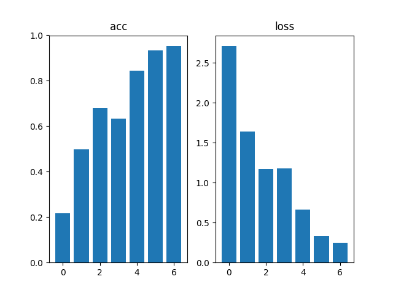

### RGB

acc
| count/比例 | 0.10: 0.70: 0.2 | 0.20: 0.60: 0.2 | 0.30: 0.50: 0.2 | 0.40: 0.40: 0.2 | 0.50: 0.30: 0.2 | 0.60: 0.20: 0.2 | 0.70: 0.10: 0.2 |
| --------: | ---------------: | ---------------: | ---------------: | ---------------: | ---------------: | ---------------: | ---------------: |
| 1 | 0.26972854137420654 | 0.44633838534355164 | 0.6747159361839294 | 0.7526041865348816 | 0.7458963990211487 | 0.7531702518463135 | 0.6979166865348816 |
| 2 | 0.31234216690063477 | 0.5462436676025391 | 0.6748737692832947 | 0.7760416865348816 | 0.7395833730697632 | 0.7604166865348816 | 0.7912137508392334 |
| 3 | 0.32796716690063477 | 0.5571338534355164 | 0.6827651262283325 | 0.7890625 | 0.7209596037864685 | 0.7925724387168884 | 0.7830615639686584 |
| 4 | 0.26925504207611084 | 0.5727588534355164 | 0.6458333134651184 | 0.73046875 | 0.7498422265052795 | 0.7821558117866516 | 0.7780797481536865 |
| 5 | 0.32354795932769775 | 0.549400269985199 | 0.6761363744735718 | 0.7213541865348816 | 0.743686854839325 | 0.7862319350242615 | 0.8084239363670349 |
| 6 | 0.2507891356945038 | 0.5419822931289673 | 0.6868686676025391 | 0.7252604365348816 | 0.7621527314186096 | 0.7866848111152649 | 0.792119562625885 |
| 7 | 0.3142361342906952 | 0.5973800420761108 | 0.6780303120613098 | 0.74609375 | 0.7618370652198792 | 0.7685688734054565 | 0.813858687877655 |
| 8 | 0.3023989796638489 | 0.5323547720909119 | 0.676294207572937 | 0.6979166865348816 | 0.7927713990211487 | 0.79347825050354 | 0.8084239363670349 |
| 9 | 0.3162878751754761 | 0.5315656661987305 | 0.6570391058921814 | 0.71875 | 0.7495265603065491 | 0.7785326242446899 | 0.7898550629615784 |
| 10 | 0.297821968793869 | 0.5422979593276978 | 0.689393937587738 | 0.7317708134651184 | 0.7555240392684937 | 0.7712862491607666 | 0.8075180649757385 |
| average | 0.29843749701976774 | 0.5417455762624741 | 0.6741950750350952 | 0.7389322996139527 | 0.7521780252456665 | 0.7773097932338715 | 0.7870471000671386 |

loss
| count/比例 | 0.10: 0.70: 0.2 | 0.20: 0.60: 0.2 | 0.30: 0.50: 0.2 | 0.40: 0.40: 0.2 | 0.50: 0.30: 0.2 | 0.60: 0.20: 0.2 | 0.70: 0.10: 0.2 |
| --------: | ---------------: | ---------------: | ---------------: | ---------------: | ---------------: | ---------------: | ---------------: |
| 1 | 3.613088369369507 | 3.991544485092163 | 1.5019370317459106 | 1.0401458740234375 | 1.0702478885650635 | 1.3552169799804688 | 2.5379040241241455 |
| 2 | 3.5732200145721436 | 2.161693811416626 | 1.2591090202331543 | 0.9512038230895996 | 1.7436214685440063 | 1.1541885137557983 | 0.9753661751747131 |
| 3 | 3.2642736434936523 | 1.9850417375564575 | 1.7725398540496826 | 0.8798849582672119 | 1.3451577425003052 | 1.024081826210022 | 0.983334481716156 |
| 4 | 3.6011362075805664 | 2.124483585357666 | 1.8060946464538574 | 1.2897820472717285 | 1.0700503587722778 | 0.9564675092697144 | 1.0293315649032593 |
| 5 | 3.4947731494903564 | 2.222670316696167 | 1.4393234252929688 | 1.264577031135559 | 1.1215094327926636 | 1.0719794034957886 | 0.8487178683280945 |
| 6 | 3.38114857673645 | 2.077460765838623 | 1.3681212663650513 | 1.1846281290054321 | 1.254339337348938 | 0.86368328332901 | 0.8987951874732971 |
| 7 | 3.2527964115142822 | 1.7298861742019653 | 1.4552241563796997 | 1.8721901178359985 | 0.929996907711029 | 1.0905592441558838 | 0.8894269466400146 |
| 8 | 3.2515180110931396 | 2.1049704551696777 | 1.4412060976028442 | 1.925615906715393 | 0.9189132452011108 | 0.9486509561538696 | 0.8234280347824097 |
| 9 | 3.3216843605041504 | 2.2910726070404053 | 1.8296455144882202 | 1.4293404817581177 | 1.234427809715271 | 0.980363667011261 | 1.1500860452651978 |
| 10 | 3.569934844970703 | 2.2546591758728027 | 1.3049665689468384 | 1.2174286842346191 | 1.1121662855148315 | 0.9803547859191895 | 0.9810863733291626 |
| average | 3.432357358932495 | 2.2943483114242555 | 1.5178167581558228 | 1.3054797053337097 | 1.1800430476665498 | 1.0425546169281006 | 1.111747670173645 |

作图如下
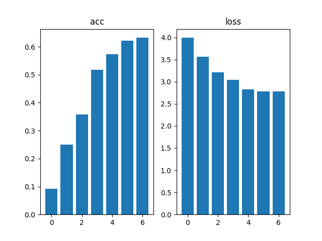

可知比例为`0.60: 0.20: 0.2`时，效果最佳。

## 3.2 波段对比实验

- 根据[实验3.1](#31-%e5%88%92%e5%88%86%e6%af%94%e4%be%8b%e7%9a%84%e7%a1%ae%e5%ae%9a)得到的最优划分，在10次随机划分进行实验；
- 依次选择单个波段的数据进行实验；
- 统计各情况下10次准确率、损失值，并计算均值；
- 做出曲线；

``` shell
cd Ecust/louishsu/recognize_stage_2
python
>>> from main_update_config import main_3_2
>>> main_3_2()      # 训练、测试
>>> main_3_2(True)  # 输出文件到`images`
```

### Multi

acc
| count/波段索引 | 1 | 2 | 3 | 4 | 5 | 6 | 7 | 8 | 9 | 10 | 11 | 12 | 13 | 14 | 15 | 16 | 17 | 18 | 19 | 20 | 21 | 22 | 23 | 24 | 25 |
| ----------: | -: | -: | -: | -: | -: | -: | -: | -: | -: | --: | --: | --: | --: | --: | --: | --: | --: | --: | --: | --: | --: | --: | --: | --: | --: |
| 1 | 0.8211050629615784 | 0.7971014976501465 | 0.8242753744125366 | 0.8134058117866516 | 0.7871376276016235 | 0.8256340622901917 | 0.7862319350242615 | 0.8346920013427734 | 0.7984601855278015 | 0.8106884360313416 | 0.7957428097724915 | 0.8106884360313416 | 0.8115941882133484 | 0.7916666865348816 | 0.8093297481536865 | 0.8211050629615784 | 0.8491848111152649 | 0.8143115639686584 | 0.8125 | 0.842391312122345 | 0.8387680649757385 | 0.8165760636329651 | 0.8102355003356934 | 0.83152174949646 | 0.8084239363670349 |
| 2 | 0.7980071902275085 | 0.7712862491607666 | 0.75951087474823 | 0.792119562625885 | 0.7454710602760315 | 0.7631340622901917 | 0.789402186870575 | 0.804347813129425 | 0.7862319350242615 | 0.8170289397239685 | 0.7767210602760315 | 0.789402186870575 | 0.7912137508392334 | 0.8061593770980835 | 0.8143115639686584 | 0.8165760636329651 | 0.8115941882133484 | 0.8478260636329651 | 0.8401268124580383 | 0.8152173757553101 | 0.7961956262588501 | 0.7794384360313416 | 0.801630437374115 | 0.7939311265945435 | 0.7925724387168884 |
| 3 | 0.8387680649757385 | 0.8192934989929199 | 0.79076087474823 | 0.82472825050354 | 0.8586956262588501 | 0.85597825050354 | 0.779891312122345 | 0.8324275612831116 | 0.8383151888847351 | 0.83152174949646 | 0.835597813129425 | 0.8369565010070801 | 0.85326087474823 | 0.8066123723983765 | 0.83152174949646 | 0.84375 | 0.8129528760910034 | 0.86548912525177 | 0.84375 | 0.8197463750839233 | 0.8496376276016235 | 0.8170289397239685 | 0.851902186870575 | 0.8686593770980835 | 0.8274456262588501 |
| 4 | 0.813858687877655 | 0.8152173757553101 | 0.7943840622901917 | 0.80027174949646 | 0.84375 | 0.7839673757553101 | 0.8038949370384216 | 0.8306159377098083 | 0.8156702518463135 | 0.8242753744125366 | 0.8152173757553101 | 0.8383151888847351 | 0.823369562625885 | 0.8152173757553101 | 0.7925724387168884 | 0.8143115639686584 | 0.8152173757553101 | 0.8455615639686584 | 0.813858687877655 | 0.8134058117866516 | 0.8201993107795715 | 0.7685688734054565 | 0.811141312122345 | 0.820652186870575 | 0.8066123723983765 |
| 5 | 0.8383151888847351 | 0.8102355003356934 | 0.8586956262588501 | 0.8505434989929199 | 0.8523550629615784 | 0.8577898144721985 | 0.8007246255874634 | 0.842391312122345 | 0.7952898144721985 | 0.8365036249160767 | 0.8260869383811951 | 0.8129528760910034 | 0.835597813129425 | 0.823369562625885 | 0.8125 | 0.8537137508392334 | 0.8215579986572266 | 0.8478260636329651 | 0.8396739363670349 | 0.8464673757553101 | 0.83152174949646 | 0.8464673757553101 | 0.823369562625885 | 0.8360506892204285 | 0.8238224387168884 |
| 6 | 0.8387680649757385 | 0.8618659377098083 | 0.8147644996643066 | 0.8052536249160767 | 0.8106884360313416 | 0.811141312122345 | 0.8147644996643066 | 0.86548912525177 | 0.7998188734054565 | 0.7975543737411499 | 0.8383151888847351 | 0.8106884360313416 | 0.854619562625885 | 0.8460144996643066 | 0.8695651888847351 | 0.8541666865348816 | 0.8288043737411499 | 0.8582428097724915 | 0.8106884360313416 | 0.8093297481536865 | 0.8405797481536865 | 0.8147644996643066 | 0.835597813129425 | 0.8134058117866516 | 0.8143115639686584 |
| 7 | 0.8211050629615784 | 0.8179348111152649 | 0.7807971239089966 | 0.7681159377098083 | 0.8020833134651184 | 0.7672101855278015 | 0.7984601855278015 | 0.7998188734054565 | 0.804347813129425 | 0.7780797481536865 | 0.8052536249160767 | 0.8161231875419617 | 0.8251811265945435 | 0.7971014976501465 | 0.7875906229019165 | 0.8211050629615784 | 0.7966485023498535 | 0.7998188734054565 | 0.7998188734054565 | 0.7998188734054565 | 0.8115941882133484 | 0.8156702518463135 | 0.7672101855278015 | 0.813858687877655 | 0.7821558117866516 |
| 8 | 0.8115941882133484 | 0.8143115639686584 | 0.8401268124580383 | 0.7966485023498535 | 0.8120471239089966 | 0.8306159377098083 | 0.7898550629615784 | 0.7984601855278015 | 0.7993659377098083 | 0.8061593770980835 | 0.7762680649757385 | 0.8034420013427734 | 0.8401268124580383 | 0.7735506892204285 | 0.8405797481536865 | 0.8038949370384216 | 0.8686593770980835 | 0.82201087474823 | 0.8134058117866516 | 0.82201087474823 | 0.8097826242446899 | 0.8251811265945435 | 0.8301630616188049 | 0.842391312122345 | 0.8396739363670349 |
| 9 | 0.8306159377098083 | 0.8147644996643066 | 0.7930253744125366 | 0.7948369383811951 | 0.823369562625885 | 0.7749093770980835 | 0.8007246255874634 | 0.8333333134651184 | 0.8188406229019165 | 0.8333333134651184 | 0.8143115639686584 | 0.8156702518463135 | 0.813858687877655 | 0.8365036249160767 | 0.8174819350242615 | 0.8251811265945435 | 0.8224637508392334 | 0.8007246255874634 | 0.8374093770980835 | 0.7971014976501465 | 0.7848731875419617 | 0.832880437374115 | 0.8509963750839233 | 0.8129528760910034 | 0.8306159377098083 |
| 10 | 0.8274456262588501 | 0.83152174949646 | 0.7880434989929199 | 0.7776268124580383 | 0.8097826242446899 | 0.820652186870575 | 0.8197463750839233 | 0.8564311265945435 | 0.8265398144721985 | 0.8152173757553101 | 0.83423912525177 | 0.8192934989929199 | 0.8319746255874634 | 0.7952898144721985 | 0.7966485023498535 | 0.842391312122345 | 0.8143115639686584 | 0.8088768124580383 | 0.8070651888847351 | 0.8165760636329651 | 0.7993659377098083 | 0.8183876276016235 | 0.7966485023498535 | 0.7980071902275085 | 0.83152174949646 |
| average | 0.8239583075046539 | 0.8153532683849335 | 0.8044384121894836 | 0.8023550689220429 | 0.8145380437374115 | 0.8091032564640045 | 0.798369574546814 | 0.8298007249832153 | 0.8082880437374115 | 0.8150362312793732 | 0.8117753565311432 | 0.8153532564640045 | 0.8280797004699707 | 0.8091485500335693 | 0.8172101497650146 | 0.8296195566654205 | 0.8241394817829132 | 0.8310688376426697 | 0.8218297123908996 | 0.8182065308094024 | 0.8182518064975739 | 0.8134963631629943 | 0.8178894937038421 | 0.8231431007385254 | 0.8157155811786652 |

loss
| count/波段索引 | 1 | 2 | 3 | 4 | 5 | 6 | 7 | 8 | 9 | 10 | 11 | 12 | 13 | 14 | 15 | 16 | 17 | 18 | 19 | 20 | 21 | 22 | 23 | 24 | 25 |
| ----------: | -: | -: | -: | -: | -: | -: | -: | -: | -: | --: | --: | --: | --: | --: | --: | --: | --: | --: | --: | --: | --: | --: | --: | --: | --: |
| 1 | 0.9496657252311707 | 0.9936584830284119 | 1.0085945129394531 | 0.8737303018569946 | 1.1915991306304932 | 0.7549974322319031 | 1.1599457263946533 | 0.7934953570365906 | 0.9340636134147644 | 0.7802156209945679 | 1.0970547199249268 | 0.7915911674499512 | 1.0459376573562622 | 1.1456526517868042 | 1.0964492559432983 | 0.8540565371513367 | 0.8025181889533997 | 1.047722578048706 | 0.8928860425949097 | 0.6463239789009094 | 0.6842600107192993 | 0.9384593367576599 | 1.0346430540084839 | 0.7592538595199585 | 0.8110252022743225 |
| 2 | 1.2795754671096802 | 1.7465345859527588 | 1.830418586730957 | 1.8558013439178467 | 2.205235242843628 | 2.407104969024658 | 1.4371376037597656 | 1.71153724193573 | 1.622277855873108 | 1.0243351459503174 | 1.6571247577667236 | 1.1659958362579346 | 1.2874436378479004 | 0.941053032875061 | 1.0377528667449951 | 1.1191493272781372 | 0.988856852054596 | 0.790794849395752 | 0.9352254271507263 | 0.9017403721809387 | 1.0019257068634033 | 1.9443953037261963 | 1.1545048952102661 | 1.006179690361023 | 1.4751427173614502 |
| 3 | 0.8315631151199341 | 0.8159720301628113 | 1.0985441207885742 | 0.7954025268554688 | 0.5746778249740601 | 0.6210147142410278 | 1.227385401725769 | 0.764219343662262 | 0.7808680534362793 | 0.8067550659179688 | 0.8363980054855347 | 0.7827090620994568 | 0.5855562090873718 | 0.833509624004364 | 0.7739096879959106 | 0.6782730221748352 | 0.8004462122917175 | 0.6154343485832214 | 0.6665509939193726 | 0.8305538892745972 | 0.5939943194389343 | 0.8511684536933899 | 0.6504239439964294 | 0.5348970293998718 | 0.8321280479431152 |
| 4 | 0.9319937229156494 | 0.8062987327575684 | 0.9103023409843445 | 0.8219806551933289 | 0.737668514251709 | 1.3106982707977295 | 0.9256033897399902 | 0.7202110886573792 | 0.8637527227401733 | 0.7117844223976135 | 0.8139702081680298 | 0.7281688451766968 | 0.8729948997497559 | 0.8204538226127625 | 1.0472512245178223 | 0.8264361619949341 | 0.8216020464897156 | 0.6529741287231445 | 0.8436477780342102 | 0.8223323225975037 | 0.7707340121269226 | 1.0241453647613525 | 0.796277642250061 | 0.7798629999160767 | 0.7840991020202637 |
| 5 | 0.6808422803878784 | 0.837618887424469 | 0.5920705199241638 | 0.6943956613540649 | 0.7070990800857544 | 0.5867810845375061 | 0.9537813067436218 | 0.6656168103218079 | 0.9447230696678162 | 0.7036720514297485 | 0.7331237196922302 | 0.9962769150733948 | 0.6558191776275635 | 0.7941519021987915 | 0.9638804793357849 | 0.7100889086723328 | 0.8499398231506348 | 0.6908676028251648 | 0.691057562828064 | 0.6519023776054382 | 0.7545948624610901 | 0.6742285490036011 | 0.8677623867988586 | 0.7227638363838196 | 0.7772329449653625 |
| 6 | 0.6737629771232605 | 0.5739679932594299 | 0.8309633135795593 | 0.8729063272476196 | 0.8236556649208069 | 1.006982684135437 | 0.8270785212516785 | 0.552436888217926 | 1.0221506357192993 | 0.9949459433555603 | 0.7679877281188965 | 1.1182667016983032 | 0.6050324440002441 | 0.7009264230728149 | 0.5710340738296509 | 0.6415630578994751 | 0.7443985939025879 | 0.6298617720603943 | 0.8995357155799866 | 1.0184366703033447 | 0.6499427556991577 | 1.0518051385879517 | 0.6839210391044617 | 0.9166327118873596 | 0.9130287170410156 |
| 7 | 0.755231499671936 | 0.8371277451515198 | 1.2652111053466797 | 1.110723853111267 | 0.8687099814414978 | 1.3129419088363647 | 0.9042167067527771 | 0.8940631151199341 | 1.0147713422775269 | 1.1630278825759888 | 0.9736307263374329 | 0.8008283376693726 | 0.7439842820167542 | 0.9433115124702454 | 0.9728971719741821 | 0.8723397254943848 | 0.9440474510192871 | 0.8720928430557251 | 0.8355490565299988 | 0.9169190526008606 | 0.972550094127655 | 0.7835375070571899 | 1.2123324871063232 | 0.8850451707839966 | 0.9859279990196228 |
| 8 | 0.7927396893501282 | 0.7792322039604187 | 0.7234867811203003 | 1.1481454372406006 | 0.8247290253639221 | 0.7329584956169128 | 0.9127988219261169 | 1.035749912261963 | 1.1573702096939087 | 0.9394725561141968 | 1.372847080230713 | 1.1392543315887451 | 0.7020249366760254 | 1.119134545326233 | 0.5917779803276062 | 0.824566662311554 | 0.5904380679130554 | 0.8764339685440063 | 0.776516318321228 | 0.7133941054344177 | 0.8489224910736084 | 0.7881633043289185 | 0.7776356339454651 | 0.7710381150245667 | 0.6883442401885986 |
| 9 | 0.728750467300415 | 0.8394255638122559 | 0.8886951804161072 | 0.9989979863166809 | 0.8263247013092041 | 1.2322441339492798 | 0.8697198629379272 | 0.779665470123291 | 0.8314498662948608 | 0.6934146881103516 | 0.8470345139503479 | 0.8672994375228882 | 0.8258286118507385 | 0.695888102054596 | 0.8483439087867737 | 0.86510169506073 | 0.7972517609596252 | 0.867919921875 | 0.6896790862083435 | 0.9941595196723938 | 1.0921926498413086 | 0.7077793478965759 | 0.6684850454330444 | 0.9251179695129395 | 0.7397245168685913 |
| 10 | 0.811479926109314 | 0.7295910120010376 | 1.4044800996780396 | 1.1081490516662598 | 0.9447125792503357 | 0.7628629207611084 | 0.9038931727409363 | 0.5830391049385071 | 0.8086133003234863 | 0.8399279117584229 | 0.6596370339393616 | 0.7058562636375427 | 0.7329002618789673 | 0.9104148149490356 | 1.0719521045684814 | 0.644931972026825 | 0.757786214351654 | 0.9115636944770813 | 0.8684442043304443 | 0.7420650124549866 | 1.0083129405975342 | 0.7169008851051331 | 0.9267532229423523 | 0.9286448359489441 | 0.6508864760398865 |
| average | 0.8435604870319366 | 0.8959427237510681 | 1.0552766561508178 | 1.0280233144760131 | 0.9704411745071411 | 1.0728586614131927 | 1.0121560513973236 | 0.850003433227539 | 0.9980040669441224 | 0.8657551288604737 | 0.9758808493614197 | 0.9096246898174286 | 0.8057522118091583 | 0.8904496431350708 | 0.8975248754024505 | 0.8036507070064545 | 0.8097285211086274 | 0.7955665707588195 | 0.8099092185497284 | 0.8237827301025391 | 0.8377429842948914 | 0.9480583190917968 | 0.8772739350795746 | 0.8229436218738556 | 0.865753996372223 |

作图如下
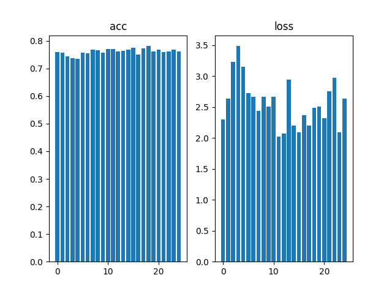

### RGB

acc
| count/波段索引 | R | G | B |
| ----------: | -: | -: | -: |
| 1 | 0.7477355003356934 | 0.7278079986572266 | 0.710597813129425 |
| 2 | 0.6847826242446899 | 0.7083333134651184 | 0.6571558117866516 |
| 3 | 0.7364130616188049 | 0.7336956262588501 | 0.7359601855278015 |
| 4 | 0.720108687877655 | 0.7038043737411499 | 0.741847813129425 |
| 5 | 0.7436593770980835 | 0.7368659377098083 | 0.7314311265945435 |
| 6 | 0.70923912525177 | 0.7558876276016235 | 0.7332428097724915 |
| 7 | 0.7264493107795715 | 0.6843296885490417 | 0.6802536249160767 |
| 8 | 0.7540760636329651 | 0.7522644996643066 | 0.77173912525177 |
| 9 | 0.7146739363670349 | 0.7323369383811951 | 0.7228260636329651 |
| 10 | 0.7459239363670349 | 0.7504528760910034 | 0.7395833134651184 |
| average | 0.7283061623573304 | 0.7285778880119324 | 0.7224637687206268 |

loss
| count/波段索引 | R | G | B |
| ----------: | -: | -: | -: |
| 1 | 1.2130966186523438 | 1.3774745464324951 | 1.6279478073120117 |
| 2 | 2.8342859745025635 | 1.9354972839355469 | 2.1175944805145264 |
| 3 | 1.30509614944458 | 1.1482808589935303 | 1.1036685705184937 |
| 4 | 1.490304708480835 | 1.3626549243927002 | 1.210271954536438 |
| 5 | 1.146216630935669 | 1.260554313659668 | 1.224961280822754 |
| 6 | 1.1802077293395996 | 1.1459215879440308 | 1.2335355281829834 |
| 7 | 1.232132077217102 | 1.6595314741134644 | 1.3966267108917236 |
| 8 | 1.158766746520996 | 1.0269274711608887 | 0.9756036996841431 |
| 9 | 1.2059093713760376 | 1.2053521871566772 | 1.1858423948287964 |
| 10 | 1.2067344188690186 | 1.1394603252410889 | 1.1762553453445435 |
| average | 1.3972750425338745 | 1.326165497303009 | 1.3252307772636414 |

作图如下
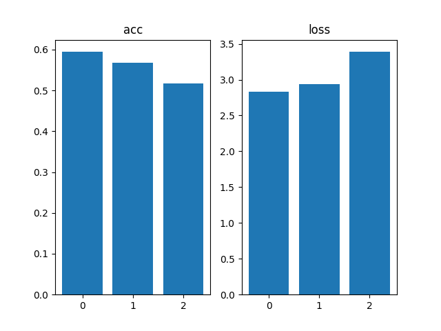

根据图3.2.1.1，按准确率将波段排序，降序排序如下：
``` shell
Generating tables and figures [Multi]...
Best:  [19 16 18 11 12  8 15 24 21  9 14 20 13 23 25 22  1  2  6 10  7 17  3  4
  5]
Generating tables and figures [RGB]...
Best:  [1 2 3]
```

## 3.3 波段组合实验

> 该部分实验仅针对多光谱数据。

- 根据[实验3.1](#31-%e5%88%92%e5%88%86%e6%af%94%e4%be%8b%e7%9a%84%e7%a1%ae%e5%ae%9a)得到的最优划分，在10次随机划分进行实验；
- 根据[实验3.2](#32-%e6%b3%a2%e6%ae%b5%e5%af%b9%e6%af%94%e5%ae%9e%e9%aa%8c)得到的最优排序，依次选择最前1, 2, ..., 25个波段进行组合实验；
- 统计各情况下10次准确率、损失值，并计算均值；
- 做出曲线；


``` shell
cd Ecust/louishsu/recognize_stage_2
python
>>> from main_update_config import main_3_3
>>> main_3_3()      # 训练、测试
>>> main_3_3(True)  # 输出文件到`images`
```

acc
| count/组合数 | 1 | 2 | 3 | 4 | 5 | 6 | 7 | 8 | 9 | 10 | 11 | 12 | 13 | 14 | 15 | 16 | 17 | 18 | 19 | 20 | 21 | 22 | 23 | 24 | 25 |
| ---------: | -: | -: | -: | -: | -: | -: | -: | -: | -: | --: | --: | --: | --: | --: | --: | --: | --: | --: | --: | --: | --: | --: | --: | --: | --: |
| 1 | 0.8101999999999999 | 0.8192934989929199 | 0.8383151888847351 | 0.8251811265945435 | 0.8106884360313416 | 0.8274456262588501 | 0.8369565010070801 | 0.8419384360313416 | 0.8319746255874634 | 0.8817934989929199 | 0.8482789397239685 | 0.8165760636329651 | 0.8179348111152649 | 0.8573369383811951 | 0.8274456262588501 | 0.8174819350242615 | 0.8038949370384216 | 0.8274456262588501 | 0.8125 | 0.77173912525177 | 0.8229166865348816 | 0.8278985023498535 | 0.845108687877655 | 0.8288043737411499 | 0.8392210602760315 |
| 2 | 0.8016 | 0.8310688734054565 | 0.8048006892204285 | 0.8038949370384216 | 0.7604166865348816 | 0.8011775612831116 | 0.7726449370384216 | 0.7604166865348816 | 0.7821558117866516 | 0.8201993107795715 | 0.7952898144721985 | 0.8020833134651184 | 0.8387680649757385 | 0.8288043737411499 | 0.7767210602760315 | 0.7740036249160767 | 0.8038949370384216 | 0.8025362491607666 | 0.7930253744125366 | 0.8025362491607666 | 0.82201087474823 | 0.8075180649757385 | 0.7794384360313416 | 0.7835144996643066 | 0.8088768124580383 |
| 3 | 0.8519 | 0.8387680649757385 | 0.8297101855278015 | 0.813858687877655 | 0.8410326242446899 | 0.813858687877655 | 0.8211050629615784 | 0.8410326242446899 | 0.8156702518463135 | 0.86548912525177 | 0.832880437374115 | 0.83423912525177 | 0.832880437374115 | 0.8174819350242615 | 0.8505434989929199 | 0.8084239363670349 | 0.842391312122345 | 0.8125 | 0.835597813129425 | 0.7930253744125366 | 0.83152174949646 | 0.8573369383811951 | 0.820652186870575 | 0.8369565010070801 | 0.820652186870575 |
| 4 | 0.8111 | 0.8125 | 0.8075180649757385 | 0.8224637508392334 | 0.8057065010070801 | 0.8709239363670349 | 0.8183876276016235 | 0.832880437374115 | 0.8464673757553101 | 0.820652186870575 | 0.875 | 0.8365036249160767 | 0.8070651888847351 | 0.8346920013427734 | 0.811141312122345 | 0.8197463750839233 | 0.801630437374115 | 0.8414855003356934 | 0.83423912525177 | 0.8432971239089966 | 0.8337862491607666 | 0.8537137508392334 | 0.7989130616188049 | 0.842391312122345 | 0.813858687877655 |
| 5 | 0.8234 | 0.8478260636329651 | 0.8537137508392334 | 0.842391312122345 | 0.854619562625885 | 0.8491848111152649 | 0.820652186870575 | 0.8446558117866516 | 0.8414855003356934 | 0.8238224387168884 | 0.8491848111152649 | 0.875 | 0.8523550629615784 | 0.8278985023498535 | 0.8505434989929199 | 0.8455615639686584 | 0.8238224387168884 | 0.8600543737411499 | 0.876358687877655 | 0.83152174949646 | 0.8260869383811951 | 0.86548912525177 | 0.8478260636329651 | 0.8505434989929199 | 0.8034420013427734 |
| 6 | 0.8356 | 0.8256340622901917 | 0.8260869383811951 | 0.8396739363670349 | 0.8410326242446899 | 0.854619562625885 | 0.8161231875419617 | 0.8491848111152649 | 0.835597813129425 | 0.8274456262588501 | 0.8161231875419617 | 0.8120471239089966 | 0.8201993107795715 | 0.8464673757553101 | 0.8301630616188049 | 0.8269928097724915 | 0.8038949370384216 | 0.80027174949646 | 0.8201993107795715 | 0.8419384360313416 | 0.8161231875419617 | 0.8125 | 0.835597813129425 | 0.8192934989929199 | 0.8106884360313416 |
| 7 | 0.7672 | 0.83152174949646 | 0.7930253744125366 | 0.7989130616188049 | 0.8211050629615784 | 0.7780797481536865 | 0.832880437374115 | 0.8156702518463135 | 0.7984601855278015 | 0.8011775612831116 | 0.8129528760910034 | 0.7925724387168884 | 0.7889493107795715 | 0.8256340622901917 | 0.8052536249160767 | 0.835597813129425 | 0.7658514976501465 | 0.8025362491607666 | 0.7975543737411499 | 0.8197463750839233 | 0.8088768124580383 | 0.8274456262588501 | 0.7998188734054565 | 0.8229166865348816 | 0.8106884360313416 |
| 8 | 0.8301999999999999 | 0.85326087474823 | 0.820652186870575 | 0.8093297481536865 | 0.8224637508392334 | 0.8478260636329651 | 0.8007246255874634 | 0.83423912525177 | 0.842391312122345 | 0.84375 | 0.8238224387168884 | 0.8192934989929199 | 0.8274456262588501 | 0.8156702518463135 | 0.7830615639686584 | 0.8396739363670349 | 0.8369565010070801 | 0.8383151888847351 | 0.8496376276016235 | 0.83423912525177 | 0.8170289397239685 | 0.8333333134651184 | 0.8079710602760315 | 0.8115941882133484 | 0.8156702518463135 |
| 9 | 0.851 | 0.7943840622901917 | 0.7930253744125366 | 0.8600543737411499 | 0.7939311265945435 | 0.8052536249160767 | 0.820652186870575 | 0.8260869383811951 | 0.7844202518463135 | 0.8134058117866516 | 0.8432971239089966 | 0.8460144996643066 | 0.8573369383811951 | 0.8455615639686584 | 0.8297101855278015 | 0.8414855003356934 | 0.8011775612831116 | 0.7957428097724915 | 0.8170289397239685 | 0.82472825050354 | 0.8251811265945435 | 0.8460144996643066 | 0.86277174949646 | 0.8260869383811951 | 0.8319746255874634 |
| 10 | 0.7966 | 0.8057065010070801 | 0.8197463750839233 | 0.8265398144721985 | 0.8192934989929199 | 0.8088768124580383 | 0.8075180649757385 | 0.8238224387168884 | 0.8224637508392334 | 0.789402186870575 | 0.8550724387168884 | 0.83423912525177 | 0.832880437374115 | 0.8278985023498535 | 0.8088768124580383 | 0.7966485023498535 | 0.820652186870575 | 0.8229166865348816 | 0.8102355003356934 | 0.8396739363670349 | 0.832880437374115 | 0.8410326242446899 | 0.8369565010070801 | 0.8274456262588501 | 0.8383151888847351 |
| average | 0.81788 | 0.8259963750839233 | 0.8186594128608704 | 0.8242300748825073 | 0.8170289874076844 | 0.8257246434688568 | 0.8147644817829132 | 0.8269927561283111 | 0.820108687877655 | 0.8287137746810913 | 0.8351902067661285 | 0.8268568813800812 | 0.8275815188884735 | 0.832744550704956 | 0.8173460245132447 | 0.8205615997314453 | 0.8104166746139526 | 0.8203804433345795 | 0.8246376752853394 | 0.820244574546814 | 0.823641300201416 | 0.8372282445430755 | 0.8235054433345794 | 0.8249547123908997 | 0.8193387687206268 |

loss
| count/组合数 | 1 | 2 | 3 | 4 | 5 | 6 | 7 | 8 | 9 | 10 | 11 | 12 | 13 | 14 | 15 | 16 | 17 | 18 | 19 | 20 | 21 | 22 | 23 | 24 | 25 |
| ---------: | -: | -: | -: | -: | -: | -: | -: | -: | -: | --: | --: | --: | --: | --: | --: | --: | --: | --: | --: | --: | --: | --: | --: | --: | --: |
| 1 | 1.0346 | 0.8257575035095215 | 0.7210565805435181 | 0.7294606566429138 | 1.085425853729248 | 0.9142743945121765 | 0.702908456325531 | 0.6758662462234497 | 0.8653731942176819 | 0.5035448670387268 | 0.6279228329658508 | 0.8530797362327576 | 0.9125879406929016 | 0.7444660067558289 | 1.030580997467041 | 0.7558407783508301 | 0.9347724318504333 | 0.7286506295204163 | 0.9195298552513123 | 1.610443115234375 | 0.8853245377540588 | 0.9164254665374756 | 0.8391698598861694 | 0.7845581769943237 | 0.6858546733856201 |
| 2 | 1.1545 | 0.8027451634407043 | 0.972329318523407 | 1.1382558345794678 | 1.7719314098358154 | 1.4696083068847656 | 1.368052363395691 | 1.9276466369628906 | 1.6247879266738892 | 0.8788036108016968 | 1.319578766822815 | 1.3002851009368896 | 0.8491395711898804 | 1.0019640922546387 | 1.4656227827072144 | 1.5475142002105713 | 1.1375690698623657 | 1.670383334159851 | 1.2497676610946655 | 1.5004771947860718 | 1.0153032541275024 | 1.2859095335006714 | 1.7260009050369263 | 1.6413170099258423 | 0.9107197523117065 |
| 3 | 0.6504 | 0.6558364629745483 | 0.6721540689468384 | 0.8908988237380981 | 0.7073768973350525 | 0.9460994601249695 | 0.7825576066970825 | 0.6015358567237854 | 0.7758689522743225 | 0.5800256133079529 | 0.7048993110656738 | 0.7068848609924316 | 0.7262181043624878 | 0.9512684941291809 | 0.6445858478546143 | 0.8930880427360535 | 0.6700407862663269 | 0.7926622629165649 | 0.7620752453804016 | 0.7987167239189148 | 0.7788880467414856 | 0.6852149367332458 | 0.7917938828468323 | 0.7131765484809875 | 0.8092471957206726 |
| 4 | 0.7963 | 0.7915062308311462 | 0.9791322946548462 | 0.7210754752159119 | 0.785041332244873 | 0.4877428114414215 | 0.711699366569519 | 0.6880524158477783 | 0.7193676233291626 | 0.7786924242973328 | 0.4778553545475006 | 0.618087649345398 | 0.9330836534500122 | 0.7326231598854065 | 0.8974423408508301 | 0.7401347160339355 | 0.760113537311554 | 0.671013355255127 | 0.80240797996521 | 0.6993030309677124 | 0.6933793425559998 | 0.5499109625816345 | 0.8550263047218323 | 0.6532172560691833 | 0.8095226883888245 |
| 5 | 0.8678 | 0.6342611312866211 | 0.6403124332427979 | 0.6750491857528687 | 0.531612753868103 | 0.7514663934707642 | 0.8059120178222656 | 0.8202605843544006 | 0.7189469337463379 | 0.8990815281867981 | 0.6383299231529236 | 0.5195474028587341 | 0.7212772369384766 | 0.7988876700401306 | 0.5910319685935974 | 0.6100196242332458 | 0.7675471305847168 | 0.602048933506012 | 0.5237951874732971 | 0.7495786547660828 | 0.8184229135513306 | 0.5480543375015259 | 0.6491055488586426 | 0.6139928698539734 | 0.9447231292724609 |
| 6 | 0.6839 | 0.8986688852310181 | 0.9376347661018372 | 0.8140369057655334 | 0.6824079751968384 | 0.6695643067359924 | 0.8929722905158997 | 0.7005531191825867 | 0.8264122009277344 | 0.7137912511825562 | 0.8068428635597229 | 0.9214103817939758 | 0.8047193288803101 | 0.6899639368057251 | 0.84787917137146 | 0.7856014966964722 | 0.9914620518684387 | 1.006433129310608 | 0.8092503547668457 | 0.724246621131897 | 0.9394853711128235 | 0.8415160179138184 | 0.6428295969963074 | 0.8793883919715881 | 0.9082703590393066 |
| 7 | 1.2123 | 0.6734341979026794 | 0.9471309781074524 | 0.8910963535308838 | 0.6799125075340271 | 0.9589447379112244 | 0.7336216568946838 | 0.768044650554657 | 1.331358790397644 | 0.8841173648834229 | 0.7809486985206604 | 0.9568995833396912 | 1.1041713953018188 | 0.737501323223114 | 0.804912805557251 | 0.660342276096344 | 1.1324245929718018 | 0.9367443323135376 | 0.9136139154434204 | 0.7361053824424744 | 0.8097032308578491 | 0.7538749575614929 | 0.9460390210151672 | 0.7898403406143188 | 0.7530288100242615 |
| 8 | 0.7776 | 0.7073320150375366 | 0.7954148650169373 | 0.8774189949035645 | 0.8942155241966248 | 0.6326645016670227 | 0.812764048576355 | 0.6827691197395325 | 0.6066079139709473 | 0.6332235336303711 | 0.7336891889572144 | 0.985440194606781 | 0.7535930871963501 | 0.8765275478363037 | 0.9393194317817688 | 0.6618034839630127 | 0.6427737474441528 | 0.7139967083930969 | 0.5854435563087463 | 0.6599225401878357 | 0.8451154828071594 | 0.6742797493934631 | 0.8296595215797424 | 0.8289491534233093 | 0.8006789088249207 |
| 9 | 0.6685 | 1.2781312465667725 | 0.8088684678077698 | 0.6069954037666321 | 1.1711345911026 | 0.852872908115387 | 0.7977939248085022 | 0.6694883108139038 | 0.9294264316558838 | 0.8399537205696106 | 0.670783519744873 | 0.5803671479225159 | 0.5570380687713623 | 0.6748276352882385 | 0.7428286075592041 | 0.6192029714584351 | 0.8006852269172668 | 0.8715615272521973 | 0.7654269933700562 | 0.7599048614501953 | 0.7744239568710327 | 0.6192367076873779 | 0.5833737254142761 | 0.858405590057373 | 0.6643590927124023 |
| 10 | 0.9268 | 0.9912732839584351 | 0.8242212533950806 | 0.6647418737411499 | 0.7601375579833984 | 0.765872061252594 | 0.7347208261489868 | 0.7572531700134277 | 0.8477545380592346 | 0.8791393041610718 | 0.599973201751709 | 0.6862882375717163 | 0.6912557482719421 | 0.6656534671783447 | 0.9072326421737671 | 0.8870818018913269 | 0.84731125831604 | 0.7575270533561707 | 0.7535046935081482 | 0.7314993739128113 | 0.6670457124710083 | 0.7002434730529785 | 0.6559416055679321 | 0.7260311245918274 | 0.6868442296981812 |
| average | 0.8772699999999999 | 0.8258946120738984 | 0.8298255026340484 | 0.8009029507637024 | 0.906919640302658 | 0.8449109882116318 | 0.8343002557754516 | 0.8291470110416412 | 0.9245904505252838 | 0.759037321805954 | 0.7360823661088943 | 0.8128290295600891 | 0.8053084135055542 | 0.7873683333396911 | 0.8871436595916748 | 0.8160629391670227 | 0.8684699833393097 | 0.8751021265983582 | 0.8084815442562103 | 0.897019749879837 | 0.822709184885025 | 0.7574666142463684 | 0.8518939971923828 | 0.8488876461982727 | 0.7973248839378357 |


作图如下
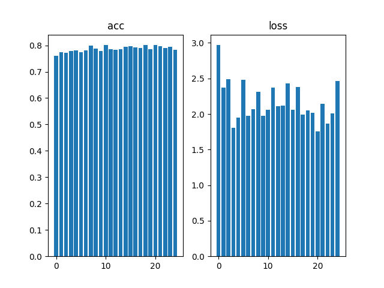

## 3.4 光谱分辨率实验

> 该部分实验仅针对多光谱数据。

- 根据[实验3.1](#31-%e5%88%92%e5%88%86%e6%af%94%e4%be%8b%e7%9a%84%e7%a1%ae%e5%ae%9a)得到的最优划分，在10次随机划分进行实验；
- 依次选择步长为1, 2, ..., 25，进行组合波段实验
- 统计各情况下10次准确率、损失值，并计算均值；
- 做出曲线；

``` shell
cd Ecust/louishsu/recognize_stage_2
python
>>> from main_update_config import main_3_4
>>> main_3_4()      # 训练、测试
>>> main_3_4(True)  # 输出文件到`images`
```

acc
| count/波段步长 | 1 | 2 | 3 | 4 | 5 | 6 | 7 | 8 | 9 | 10 | 11 | 12 | 13 | 14 | 15 | 16 | 17 | 18 | 19 | 20 | 21 | 22 | 23 | 24 | 25 |
| ----------: | -: | -: | -: | -: | -: | -: | -: | -: | -: | --: | --: | --: | --: | --: | --: | --: | --: | --: | --: | --: | --: | --: | --: | --: | --: |
| 1 | 0.8297 | 0.8496376276016235 | 0.8614130616188049 | 0.8066123723983765 | 0.789402186870575 | 0.8215579986572266 | 0.8192934989929199 | 0.8310688734054565 | 0.8817934989929199 | 0.8586956262588501 | 0.8278985023498535 | 0.8260869383811951 | 0.8179348111152649 | 0.832880437374115 | 0.8365036249160767 | 0.8414855003356934 | 0.8224637508392334 | 0.8324275612831116 | 0.7998188734054565 | 0.804347813129425 | 0.8242753744125366 | 0.82201087474823 | 0.8333333134651184 | 0.7889493107795715 | 0.8210999999999999 |
| 2 | 0.7994 | 0.8134058117866516 | 0.83152174949646 | 0.8115941882133484 | 0.7943840622901917 | 0.8066123723983765 | 0.8048006892204285 | 0.7817028760910034 | 0.8482789397239685 | 0.8052536249160767 | 0.83152174949646 | 0.8374093770980835 | 0.8251811265945435 | 0.8251811265945435 | 0.8224637508392334 | 0.7916666865348816 | 0.8514493107795715 | 0.7884963750839233 | 0.8174819350242615 | 0.7993659377098083 | 0.8319746255874634 | 0.792119562625885 | 0.8061593770980835 | 0.8048006892204285 | 0.7979999999999999 |
| 3 | 0.8261 | 0.8020833134651184 | 0.8020833134651184 | 0.8129528760910034 | 0.8414855003356934 | 0.8238224387168884 | 0.8369565010070801 | 0.8061593770980835 | 0.85597825050354 | 0.8496376276016235 | 0.8129528760910034 | 0.8722826242446899 | 0.8505434989929199 | 0.8374093770980835 | 0.8369565010070801 | 0.8573369383811951 | 0.8360506892204285 | 0.8509963750839233 | 0.8147644996643066 | 0.83423912525177 | 0.8066123723983765 | 0.86277174949646 | 0.8088768124580383 | 0.85597825050354 | 0.8388 |
| 4 | 0.8423999999999999 | 0.8215579986572266 | 0.8061593770980835 | 0.8523550629615784 | 0.83152174949646 | 0.8432971239089966 | 0.8278985023498535 | 0.8346920013427734 | 0.8115941882133484 | 0.8455615639686584 | 0.8097826242446899 | 0.8374093770980835 | 0.8333333134651184 | 0.8165760636329651 | 0.7961956262588501 | 0.8505434989929199 | 0.8745471239089966 | 0.8496376276016235 | 0.8885869383811951 | 0.8387680649757385 | 0.85597825050354 | 0.8265398144721985 | 0.820652186870575 | 0.83152174949646 | 0.8139 |
| 5 | 0.8628 | 0.8197463750839233 | 0.8491848111152649 | 0.8224637508392334 | 0.8165760636329651 | 0.8260869383811951 | 0.8605071902275085 | 0.8215579986572266 | 0.8509963750839233 | 0.823369562625885 | 0.8414855003356934 | 0.8700180649757385 | 0.8428441882133484 | 0.8383151888847351 | 0.8491848111152649 | 0.8183876276016235 | 0.8211050629615784 | 0.8365036249160767 | 0.7966485023498535 | 0.8410326242446899 | 0.8455615639686584 | 0.82472825050354 | 0.8523550629615784 | 0.82201087474823 | 0.8382999999999999 |
| 6 | 0.8423999999999999 | 0.8269928097724915 | 0.8378623723983765 | 0.8134058117866516 | 0.8283514976501465 | 0.7925724387168884 | 0.8292571902275085 | 0.8790760636329651 | 0.8201993107795715 | 0.8134058117866516 | 0.8120471239089966 | 0.8333333134651184 | 0.8269928097724915 | 0.842391312122345 | 0.8614130616188049 | 0.8360506892204285 | 0.8265398144721985 | 0.8491848111152649 | 0.8152173757553101 | 0.8346920013427734 | 0.8432971239089966 | 0.8428441882133484 | 0.8229166865348816 | 0.7912137508392334 | 0.8388 |
| 7 | 0.8079999999999999 | 0.7848731875419617 | 0.8369565010070801 | 0.7780797481536865 | 0.8188406229019165 | 0.8238224387168884 | 0.7998188734054565 | 0.8165760636329651 | 0.8048006892204285 | 0.8324275612831116 | 0.7943840622901917 | 0.7875906229019165 | 0.8337862491607666 | 0.7712862491607666 | 0.7939311265945435 | 0.8419384360313416 | 0.7912137508392334 | 0.8066123723983765 | 0.7998188734054565 | 0.7903079986572266 | 0.84375 | 0.7712862491607666 | 0.7749093770980835 | 0.8048006892204285 | 0.8210999999999999 |
| 8 | 0.8197 | 0.8491848111152649 | 0.811141312122345 | 0.8170289397239685 | 0.8093297481536865 | 0.8387680649757385 | 0.835597813129425 | 0.8482789397239685 | 0.8564311265945435 | 0.82201087474823 | 0.83423912525177 | 0.8333333134651184 | 0.8251811265945435 | 0.845108687877655 | 0.82472825050354 | 0.85597825050354 | 0.873641312122345 | 0.8161231875419617 | 0.8211050629615784 | 0.8057065010070801 | 0.866847813129425 | 0.8165760636329651 | 0.873641312122345 | 0.8428441882133484 | 0.8116 |
| 9 | 0.7917000000000001 | 0.8414855003356934 | 0.8093297481536865 | 0.8238224387168884 | 0.8188406229019165 | 0.80298912525177 | 0.8306159377098083 | 0.8129528760910034 | 0.8211050629615784 | 0.8143115639686584 | 0.8537137508392334 | 0.8007246255874634 | 0.8129528760910034 | 0.8075180649757385 | 0.8106884360313416 | 0.86277174949646 | 0.85597825050354 | 0.8179348111152649 | 0.8066123723983765 | 0.8374093770980835 | 0.8007246255874634 | 0.8473731875419617 | 0.8129528760910034 | 0.7916666865348816 | 0.8306 |
| 10 | 0.8007 | 0.8066123723983765 | 0.7948369383811951 | 0.8097826242446899 | 0.7898550629615784 | 0.8292571902275085 | 0.8478260636329651 | 0.8278985023498535 | 0.83152174949646 | 0.8211050629615784 | 0.7939311265945435 | 0.8079710602760315 | 0.8383151888847351 | 0.8455615639686584 | 0.8369565010070801 | 0.8509963750839233 | 0.8319746255874634 | 0.8482789397239685 | 0.8256340622901917 | 0.8084239363670349 | 0.8147644996643066 | 0.8301630616188049 | 0.8369565010070801 | 0.8183876276016235 | 0.8273999999999999 |
| average | 0.82229 | 0.8215579807758331 | 0.8240489184856414 | 0.8148097813129425 | 0.813858711719513 | 0.8208786129951477 | 0.8292572259902954 | 0.82599635720253 | 0.8382699191570282 | 0.8285778880119323 | 0.8211956441402435 | 0.8306159317493439 | 0.8307065188884735 | 0.8262228071689606 | 0.8269021689891816 | 0.8407155752182007 | 0.8384963691234588 | 0.8296195685863494 | 0.8185688495635987 | 0.819429337978363 | 0.8333786249160766 | 0.823641300201416 | 0.8242753505706787 | 0.8152173817157745 | 0.8239599999999999 |

loss
| count/波段步长 | 1 | 2 | 3 | 4 | 5 | 6 | 7 | 8 | 9 | 10 | 11 | 12 | 13 | 14 | 15 | 16 | 17 | 18 | 19 | 20 | 21 | 22 | 23 | 24 | 25 |
| ----------: | -: | -: | -: | -: | -: | -: | -: | -: | -: | --: | --: | --: | --: | --: | --: | --: | --: | --: | --: | --: | --: | --: | --: | --: | --: |
| 1 | 0.8587 | 0.5985684990882874 | 0.5356584787368774 | 1.0011874437332153 | 1.1101607084274292 | 0.9441021680831909 | 0.9318942427635193 | 0.8152605891227722 | 0.49474358558654785 | 0.5365665555000305 | 0.8514651656150818 | 0.7574261426925659 | 0.7338264584541321 | 0.8932234644889832 | 0.8696075677871704 | 0.6340237259864807 | 0.9906333684921265 | 0.8475795984268188 | 1.1679296493530273 | 0.8053727149963379 | 0.9256128072738647 | 0.9680324196815491 | 0.7324010729789734 | 1.323514461517334 | 0.9497 |
| 2 | 1.1502 | 1.0176540613174438 | 0.8618543744087219 | 1.2693684101104736 | 1.1564364433288574 | 1.2409414052963257 | 1.3938076496124268 | 1.6312212944030762 | 0.8175966739654541 | 1.0541176795959473 | 0.9654911756515503 | 0.9680821895599365 | 0.9900546073913574 | 0.8902605175971985 | 0.953059732913971 | 1.242834210395813 | 0.8161790370941162 | 1.2157171964645386 | 1.0945791006088257 | 1.2985631227493286 | 1.2871888875961304 | 1.033758521080017 | 1.1154123544692993 | 1.1666942834854126 | 1.2796 |
| 3 | 0.7178 | 0.9402275085449219 | 1.1427124738693237 | 0.9478744268417358 | 0.6723776459693909 | 0.9153621792793274 | 0.780606210231781 | 0.8908146619796753 | 0.651093065738678 | 0.6394826173782349 | 0.8402518630027771 | 0.598864734172821 | 0.6021148562431335 | 0.7243866324424744 | 0.7234815359115601 | 0.5983564257621765 | 0.7957603335380554 | 0.5946634411811829 | 1.0916913747787476 | 0.8721807599067688 | 0.8139532208442688 | 0.6150047183036804 | 1.0115840435028076 | 0.6675941348075867 | 0.8316 |
| 4 | 0.665 | 0.7311530113220215 | 1.0224937200546265 | 0.6190547943115234 | 0.7222946286201477 | 0.6287878751754761 | 0.67256760597229 | 0.6672437191009521 | 0.8206981420516968 | 0.6500006318092346 | 0.8520459532737732 | 0.75514817237854 | 0.7994221448898315 | 0.8072776198387146 | 0.9657924771308899 | 0.7135368585586548 | 0.5127297639846802 | 0.6321741938591003 | 0.41865530610084534 | 0.7694806456565857 | 0.62164705991745 | 0.7402157187461853 | 0.7315459847450256 | 0.6635580658912659 | 0.932 |
| 5 | 0.573 | 0.7554605603218079 | 0.6758705377578735 | 0.8230921030044556 | 0.854537308216095 | 0.8027995824813843 | 0.628731906414032 | 0.7685883641242981 | 0.734675943851471 | 0.7763500809669495 | 0.8139427900314331 | 0.5419008135795593 | 0.7083641290664673 | 0.6423208117485046 | 0.6183068752288818 | 0.8220583200454712 | 0.7862902283668518 | 0.7660040855407715 | 0.9315482974052429 | 0.6456587314605713 | 0.6748316287994385 | 0.8666454553604126 | 0.6476181149482727 | 0.8406981825828552 | 0.6808 |
| 6 | 0.7297 | 0.7536693811416626 | 0.737503707408905 | 0.9463911652565002 | 0.7441673874855042 | 1.036614179611206 | 0.7852297425270081 | 0.5678576827049255 | 0.8458834886550903 | 0.8347810506820679 | 0.92336505651474 | 0.9190218448638916 | 1.0085302591323853 | 0.7250561118125916 | 0.5469180941581726 | 0.6547771692276001 | 0.8576958775520325 | 0.6357523202896118 | 1.0149180889129639 | 0.7687923312187195 | 0.7155240178108215 | 0.716958224773407 | 0.7649377584457397 | 1.3145054578781128 | 0.6738 |
| 7 | 0.8571 | 0.9622517228126526 | 0.7290322780609131 | 1.0553905963897705 | 0.8217887282371521 | 0.6315202116966248 | 0.8937628269195557 | 0.698430597782135 | 0.7774447798728943 | 0.6944960355758667 | 1.016097068786621 | 0.9005790948867798 | 0.7028904557228088 | 1.0290677547454834 | 1.0486719608306885 | 0.6404780745506287 | 1.0695849657058716 | 0.7280130982398987 | 1.0532299280166626 | 1.086535930633545 | 0.7139935493469238 | 1.200251817703247 | 1.1699349880218506 | 0.8482652902603149 | 0.7552 |
| 8 | 0.9581 | 0.6242732405662537 | 0.8240231871604919 | 0.7591571807861328 | 0.9774377346038818 | 0.6543126106262207 | 0.6649042367935181 | 0.6157693862915039 | 0.6581440567970276 | 0.7762998342514038 | 0.861187219619751 | 0.7213444709777832 | 0.7431575059890747 | 0.6506799459457397 | 0.8185639381408691 | 0.6136940717697144 | 0.538821280002594 | 0.7513191103935242 | 0.7397361993789673 | 0.8596806526184082 | 0.5564875602722168 | 0.8074188232421875 | 0.5482491850852966 | 0.730084240436554 | 0.7927 |
| 9 | 0.9368 | 0.6579684019088745 | 0.862577497959137 | 0.7779151201248169 | 0.8178852796554565 | 1.10133695602417 | 0.6564565896987915 | 0.8184730410575867 | 0.861049473285675 | 0.7905576825141907 | 0.5969030261039734 | 1.2449252605438232 | 1.1311272382736206 | 0.84876549243927 | 0.821247935295105 | 0.634738028049469 | 0.5608720779418945 | 1.0028289556503296 | 1.039434790611267 | 0.7013670802116394 | 0.9793233275413513 | 0.7030855417251587 | 0.8970090746879578 | 1.1865657567977905 | 0.7288 |
| 10 | 0.9543 | 1.1027634143829346 | 0.8598230481147766 | 0.7933375239372253 | 0.979127049446106 | 0.7439116835594177 | 0.5834032893180847 | 0.6880106925964355 | 0.6920923590660095 | 0.7440581321716309 | 0.8218757510185242 | 0.9019281268119812 | 0.7148038744926453 | 0.6229981184005737 | 0.6664844155311584 | 0.6326518058776855 | 0.6237415075302124 | 0.6783167719841003 | 0.8051922917366028 | 0.8829913139343262 | 0.8174347281455994 | 0.7291621565818787 | 0.7650764584541321 | 0.9195069074630737 | 0.8115 |
| average | 0.8400700000000001 | 0.814398980140686 | 0.8251549303531647 | 0.899276876449585 | 0.885621291399002 | 0.8699688851833344 | 0.7991364300251007 | 0.816167002916336 | 0.7353421568870544 | 0.7496710300445557 | 0.8542625069618225 | 0.8309220850467682 | 0.8134291529655456 | 0.7834036469459533 | 0.8032134532928467 | 0.7187148690223694 | 0.7552308440208435 | 0.7852368772029876 | 0.9356915026903152 | 0.8690623283386231 | 0.8105996787548065 | 0.8380533397197724 | 0.8383769035339356 | 0.96609867811203 | 0.84357 |

作图如下
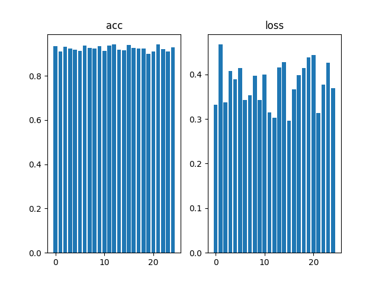

## 3.5 鲁棒性实验

- 根据[实验3.1](#31-%e5%88%92%e5%88%86%e6%af%94%e4%be%8b%e7%9a%84%e7%a1%ae%e5%ae%9a)得到的最优划分，在10次随机划分进行实验；
- 选用全部波段进行实验；
- 统计10次实验中，改变条件得到表格；
- 做出曲线

``` shell
cd Ecust/louishsu/recognize_stage_2
python
>>> from main_update_config import main_3_5
>>> main_3_5()      # 训练、测试
>>> main_3_5(True)  # 输出文件到`images`
```

### 3.5.1 干扰种类

统计无干扰、干扰1、干扰2、干扰3下，每次实验的准确率、损失

**仅包含position=4**

#### Multi

acc
| count/光照 | illum1 | illum2 | illum3 | normal |
| --------: | ------: | ------: | ------: | ------: |
| 1 | 0.6304348111152649 | 0.739130437374115 | 0.4193548262119293 | 0.6571428775787354 |
| 2 | 0.6000000238418579 | 0.625 | 0.6341463327407837 | 0.5277777910232544 |
| 3 | 0.4838709533214569 | 0.739130437374115 | 0.6000000238418579 | 0.6571428775787354 |
| 4 | 0.692307710647583 | 0.644444465637207 | 0.6585366129875183 | 0.5609756112098694 |
| 5 | 0.6666666865348816 | 0.6060606241226196 | 0.7096773982048035 | 0.71875 |
| 6 | 0.6170212626457214 | 0.7027027010917664 | 0.6499999761581421 | 0.6511628031730652 |
| 7 | 0.557692289352417 | 0.625 | 0.5306122303009033 | 0.6315789222717285 |
| 8 | 0.6739130616188049 | 0.675000011920929 | 0.6279069781303406 | 0.6000000238418579 |
| 9 | 0.5897436141967773 | 0.6136363744735718 | 0.54347825050354 | 0.5526315569877625 |
| 10 | 0.5681818127632141 | 0.6111111044883728 | 0.6000000238418579 | 0.6363636255264282 |
| average | 0.6079832226037979 | 0.6581216156482697 | 0.5973712652921677 | 0.6193526089191437 |

loss
| count/光照 | illum1 | illum2 | illum3 | normal |
| --------: | ------: | ------: | ------: | ------: |
| 1 | 1.515424370765686 | 1.570702075958252 | 3.446721315383911 | 1.7715245485305786 |
| 2 | 2.4775962829589844 | 2.6063427925109863 | 2.1741929054260254 | 3.840662717819214 |
| 3 | 1.957628846168518 | 1.1124435663223267 | 1.6466648578643799 | 1.3283723592758179 |
| 4 | 1.1659184694290161 | 1.4522491693496704 | 1.7395330667495728 | 1.9549607038497925 |
| 5 | 1.5063660144805908 | 1.6744688749313354 | 1.2582175731658936 | 1.0710556507110596 |
| 6 | 2.003814935684204 | 1.8102643489837646 | 1.4461162090301514 | 1.741736650466919 |
| 7 | 2.2988457679748535 | 1.5332356691360474 | 2.295715093612671 | 1.514491319656372 |
| 8 | 1.7690362930297852 | 1.9699580669403076 | 2.5678701400756836 | 2.0634379386901855 |
| 9 | 1.9920358657836914 | 2.044135808944702 | 2.059256076812744 | 1.8723772764205933 |
| 10 | 1.9202426671981812 | 1.7843023538589478 | 2.1929593086242676 | 2.2835447788238525 |
| average | 1.860690951347351 | 1.755810272693634 | 2.08272465467453 | 1.9442163944244384 |


作图如下
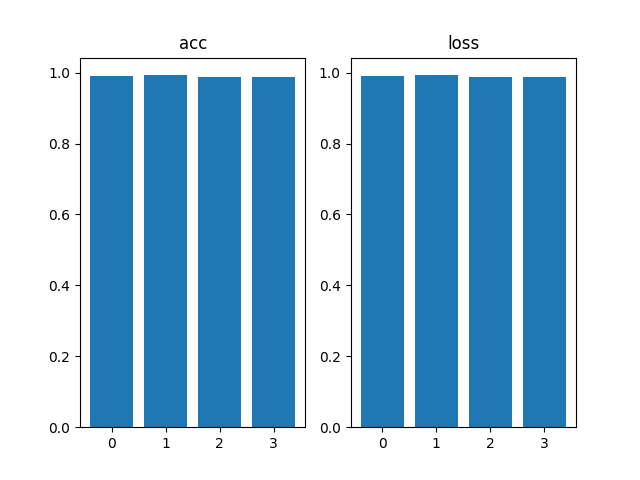

#### RGB

acc
| count/光照 | illum1 | illum2 | illum3 | normal |
| --------: | ------: | ------: | ------: | ------: |
| 1 | 0.5 | 0.5869565010070801 | 0.4193548262119293 | 0.5142857432365417 |
| 2 | 0.6222222447395325 | 0.550000011920929 | 0.6829268336296082 | 0.5277777910232544 |
| 3 | 0.4516128897666931 | 0.6304348111152649 | 0.6499999761581421 | 0.5428571701049805 |
| 4 | 0.6153846383094788 | 0.5555555820465088 | 0.6341463327407837 | 0.5121951103210449 |
| 5 | 0.5555555820465088 | 0.4848484992980957 | 0.7096773982048035 | 0.59375 |
| 6 | 0.6170212626457214 | 0.5945945978164673 | 0.550000011920929 | 0.5116279125213623 |
| 7 | 0.38461539149284363 | 0.5625 | 0.4693877696990967 | 0.6578947305679321 |
| 8 | 0.739130437374115 | 0.574999988079071 | 0.604651153087616 | 0.6000000238418579 |
| 9 | 0.6153846383094788 | 0.6818181872367859 | 0.5 | 0.6578947305679321 |
| 10 | 0.5454545617103577 | 0.5555555820465088 | 0.5 | 0.6590909361839294 |
| average | 0.5646381646394729 | 0.5777263760566711 | 0.5720144301652909 | 0.5777374148368836 |

loss
| count/光照 | illum1 | illum2 | illum3 | normal |
| --------: | ------: | ------: | ------: | ------: |
| 1 | 3.593595504760742 | 2.7178409099578857 | 4.190008640289307 | 3.5872862339019775 |
| 2 | 1.9419499635696411 | 2.4037115573883057 | 1.7698380947113037 | 3.2195451259613037 |
| 3 | 3.2914748191833496 | 2.7010130882263184 | 2.1117215156555176 | 2.950246810913086 |
| 4 | 1.8237746953964233 | 2.12752103805542 | 1.6611067056655884 | 2.3926022052764893 |
| 5 | 2.892038345336914 | 3.0712177753448486 | 1.7103261947631836 | 2.9145314693450928 |
| 6 | 1.5501741170883179 | 1.6328017711639404 | 2.220686197280884 | 2.030081033706665 |
| 7 | 3.0933737754821777 | 2.17620587348938 | 2.6157610416412354 | 1.6988818645477295 |
| 8 | 1.4030990600585938 | 2.2434380054473877 | 1.8901046514511108 | 2.0278263092041016 |
| 9 | 1.9779229164123535 | 1.9491314888000488 | 2.198361873626709 | 1.6200672388076782 |
| 10 | 2.0910019874572754 | 2.18280029296875 | 2.2615017890930176 | 1.9180973768234253 |
| average | 2.3658405184745788 | 2.3205681800842286 | 2.262941670417786 | 2.435916566848755 |

作图如下
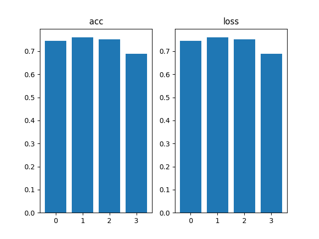

### 3.5.2 偏转角度

统计各角度下，每次实验的准确率、损失

**仅包含glass_type=1**

#### Multi

acc
| count/位置 | 1 | 2 | 3 | 4 | 5 | 6 | 7 |
| --------: | -: | -: | -: | -: | -: | -: | -: |
| 1 | 0.9583333134651184 | 1.0 | 1.0 | 1.0 | 1.0 | 1.0 | 0.9692307710647583 |
| 2 | 0.8985507488250732 | 0.9285714030265808 | 0.9599999785423279 | 0.9714285731315613 | 0.9729729890823364 | 1.0 | 0.8833333253860474 |
| 3 | 0.9736841917037964 | 0.96875 | 1.0 | 1.0 | 1.0 | 1.0 | 0.953125 |
| 4 | 0.9577465057373047 | 1.0 | 1.0 | 1.0 | 1.0 | 0.9878048896789551 | 0.9861111044883728 |
| 5 | 0.9242424368858337 | 0.9878048896789551 | 1.0 | 1.0 | 1.0 | 1.0 | 0.9285714030265808 |
| 6 | 0.9672130942344666 | 0.9733333587646484 | 0.9838709831237793 | 1.0 | 1.0 | 1.0 | 0.9354838728904724 |
| 7 | 0.9696969985961914 | 0.9855072498321533 | 1.0 | 1.0 | 1.0 | 0.9855072498321533 | 0.982758641242981 |
| 8 | 0.9508196711540222 | 0.9402984976768494 | 1.0 | 1.0 | 1.0 | 1.0 | 0.931506872177124 |
| 9 | 0.9866666793823242 | 0.9605262875556946 | 1.0 | 1.0 | 0.9857142567634583 | 1.0 | 0.9154929518699646 |
| 10 | 0.9692307710647583 | 0.9624999761581421 | 0.9861111044883728 | 1.0 | 1.0 | 1.0 | 0.9253731369972229 |
| average | 0.9556184411048889 | 0.9707291662693024 | 0.992998206615448 | 0.9971428573131561 | 0.9958687245845794 | 0.9973312139511108 | 0.9410987079143525 |

loss
| count/位置 | 1 | 2 | 3 | 4 | 5 | 6 | 7 |
| --------: | -: | -: | -: | -: | -: | -: | -: |
| 1 | 0.19898250699043274 | 0.02499772422015667 | 0.007049409206956625 | 0.0037649008445441723 | 0.0040639853104949 | 0.014974030666053295 | 0.12106198072433472 |
| 2 | 0.19199441373348236 | 0.19658957421779633 | 0.06906949728727341 | 0.21194274723529816 | 0.16547316312789917 | 0.03422907739877701 | 0.6545495390892029 |
| 3 | 0.10253102332353592 | 0.14476779103279114 | 0.004487256519496441 | 0.003204093314707279 | 0.003511018119752407 | 0.017074620351195335 | 0.19198362529277802 |
| 4 | 0.2049941122531891 | 0.04572002962231636 | 0.0033788681030273438 | 0.005698951426893473 | 0.003365857293829322 | 0.026351435109972954 | 0.07070919871330261 |
| 5 | 0.20320254564285278 | 0.03583088889718056 | 0.0025527894031256437 | 0.005912881810218096 | 0.01161274779587984 | 0.024660373106598854 | 0.29501578211784363 |
| 6 | 0.0854538232088089 | 0.09156231582164764 | 0.02263369783759117 | 0.004514952190220356 | 0.003601545002311468 | 0.01373747643083334 | 0.2344718724489212 |
| 7 | 0.12244237214326859 | 0.060356415808200836 | 0.0035240943543612957 | 0.0043929205276072025 | 0.004844420589506626 | 0.02568327821791172 | 0.15624026954174042 |
| 8 | 0.24023118615150452 | 0.24323534965515137 | 0.0037125430535525084 | 0.005198046565055847 | 0.0114912623539567 | 0.02674676477909088 | 0.3547074794769287 |
| 9 | 0.05166596546769142 | 0.1321222484111786 | 0.002574262907728553 | 0.002430972410365939 | 0.04272856563329697 | 0.009694721549749374 | 0.2375156581401825 |
| 10 | 0.10178600996732712 | 0.15802006423473358 | 0.02926216460764408 | 0.008674707263708115 | 0.007332338485866785 | 0.01443606335669756 | 0.2516622841358185 |
| average | 0.15032839588820934 | 0.11332024019211531 | 0.014824458328075708 | 0.025573517358861864 | 0.025802490371279418 | 0.02075878409668803 | 0.2567917689681053 |

作图如下
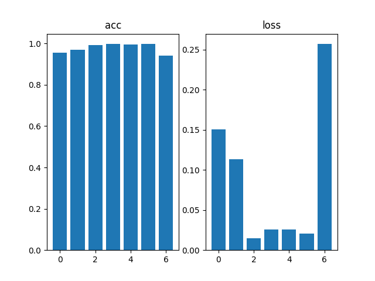

#### RGB

acc
| count/位置 | 1 | 2 | 3 | 4 | 5 | 6 | 7 |
| --------: | -: | -: | -: | -: | -: | -: | -: |
| 1 | 0.8472222089767456 | 0.9726027250289917 | 1.0 | 0.9846153855323792 | 0.9615384340286255 | 0.9545454382896423 | 0.7846153974533081 |
| 2 | 0.739130437374115 | 0.8857142925262451 | 0.9333333373069763 | 0.9714285731315613 | 0.9594594836235046 | 0.9740259647369385 | 0.6333333253860474 |
| 3 | 0.8684210777282715 | 0.9375 | 0.9764705896377563 | 1.0 | 0.9722222089767456 | 0.9411764740943909 | 0.828125 |
| 4 | 0.9154929518699646 | 0.9655172228813171 | 0.984375 | 1.0 | 0.9714285731315613 | 0.9878048896789551 | 0.8333333134651184 |
| 5 | 0.8181818127632141 | 0.9878048896789551 | 1.0 | 0.9848484992980957 | 0.9868420958518982 | 0.9358974099159241 | 0.800000011920929 |
| 6 | 0.868852436542511 | 0.9733333587646484 | 1.0 | 1.0 | 0.9615384340286255 | 0.9871794581413269 | 0.8225806355476379 |
| 7 | 0.8939393758773804 | 0.95652174949646 | 0.9824561476707458 | 0.9864864945411682 | 0.9864864945411682 | 0.9710144996643066 | 0.9137930870056152 |
| 8 | 0.868852436542511 | 0.9552238583564758 | 0.9452054500579834 | 0.9882352948188782 | 1.0 | 0.9850746393203735 | 0.7808219194412231 |
| 9 | 0.8133333325386047 | 0.9736841917037964 | 1.0 | 1.0 | 0.9857142567634583 | 0.9722222089767456 | 0.7323943376541138 |
| 10 | 0.8769230842590332 | 0.9624999761581421 | 1.0 | 1.0 | 0.9718309640884399 | 0.9636363387107849 | 0.8358209133148193 |
| average | 0.8510349154472351 | 0.9570402264595032 | 0.9821840524673462 | 0.9915614247322082 | 0.9757060945034027 | 0.9672577321529389 | 0.7964817941188812 |

loss
| count/位置 | 1 | 2 | 3 | 4 | 5 | 6 | 7 |
| --------: | -: | -: | -: | -: | -: | -: | -: |
| 1 | 0.5605213642120361 | 0.09017366915941238 | 0.030459070578217506 | 0.050492286682128906 | 0.0951564759016037 | 0.23043379187583923 | 0.6483961343765259 |
| 2 | 1.098435640335083 | 0.4137367904186249 | 0.28298962116241455 | 0.110237717628479 | 0.10201257467269897 | 0.11078225076198578 | 1.3305728435516357 |
| 3 | 0.6197947263717651 | 0.2264767587184906 | 0.12225735932588577 | 0.019736409187316895 | 0.059452276676893234 | 0.15124621987342834 | 0.6460277438163757 |
| 4 | 0.3454452157020569 | 0.069605752825737 | 0.08884090930223465 | 0.004698760341852903 | 0.08824741095304489 | 0.12756703794002533 | 0.7553895115852356 |
| 5 | 0.6332056522369385 | 0.06519671529531479 | 0.008833960629999638 | 0.042494166642427444 | 0.06653585284948349 | 0.3104461133480072 | 0.8089169263839722 |
| 6 | 0.5859944820404053 | 0.15122823417186737 | 0.0076506370678544044 | 0.015368732623755932 | 0.055032722651958466 | 0.0802980363368988 | 0.5948123931884766 |
| 7 | 0.536247730255127 | 0.18346647918224335 | 0.07599414139986038 | 0.055614251643419266 | 0.028423065319657326 | 0.20876182615756989 | 0.36228784918785095 |
| 8 | 0.6603409647941589 | 0.14270997047424316 | 0.13089868426322937 | 0.058495111763477325 | 0.027238700538873672 | 0.10589337348937988 | 0.9015978574752808 |
| 9 | 0.5716894268989563 | 0.11508681625127792 | 0.05228963494300842 | 0.0052521792240440845 | 0.0473315566778183 | 0.11264869570732117 | 0.9138184785842896 |
| 10 | 0.5190131068229675 | 0.165860116481781 | 0.021911462768912315 | 0.019618868827819824 | 0.08350910991430283 | 0.19385896623134613 | 0.5008023381233215 |
| average | 0.6130688309669494 | 0.16235413029789925 | 0.0822125481441617 | 0.03820084845647216 | 0.0652939746156335 | 0.16319363117218016 | 0.7462622076272964 |

作图如下
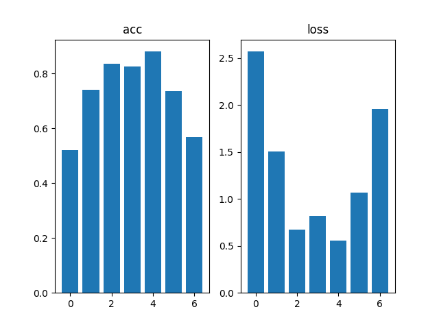

### 3.5.3 遮挡实验

统计无眼镜、近视眼镜、太阳镜下，每次实验的准确率、损失

#### Multi

acc
| count/眼镜 | 1 | 5 | 6 |
| --------: | -: | -: | -: |
| 1 | 0.9896265268325806 | 0.607594907283783 | 0.2763157784938812 |
| 2 | 0.9474747180938721 | 0.5677419304847717 | 0.19696970283985138 |
| 3 | 0.98591548204422 | 0.5194805264472961 | 0.2769230902194977 |
| 4 | 0.9896694421768188 | 0.6265822649002075 | 0.29729729890823364 |
| 5 | 0.9780439138412476 | 0.6666666865348816 | 0.38461539149284363 |
| 6 | 0.981632649898529 | 0.6333333253860474 | 0.31578946113586426 |
| 7 | 0.9892933368682861 | 0.5909090638160706 | 0.2631579041481018 |
| 8 | 0.9756097793579102 | 0.5617284178733826 | 0.22580644488334656 |
| 9 | 0.977911651134491 | 0.44594594836235046 | 0.18571428954601288 |
| 10 | 0.9771783947944641 | 0.49696969985961914 | 0.260869562625885 |
| average | 0.9792355895042419 | 0.571695277094841 | 0.2683458924293518 |

loss
| count/眼镜 | 1 | 5 | 6 |
| --------: | -: | -: | -: |
| 1 | 0.05397241190075874 | 1.9961684942245483 | 3.7226450443267822 |
| 2 | 0.20440146327018738 | 2.3618297576904297 | 5.602774620056152 |
| 3 | 0.06309375911951065 | 1.9489222764968872 | 3.012773036956787 |
| 4 | 0.05225598067045212 | 1.4604887962341309 | 3.0895049571990967 |
| 5 | 0.08055444806814194 | 1.360411524772644 | 2.6827425956726074 |
| 6 | 0.06062646582722664 | 1.6112438440322876 | 3.4648091793060303 |
| 7 | 0.05131542682647705 | 1.7186081409454346 | 3.53769850730896 |
| 8 | 0.12217029929161072 | 2.163999080657959 | 4.669853687286377 |
| 9 | 0.06988543272018433 | 2.5268394947052 | 3.887953042984009 |
| 10 | 0.08333006501197815 | 2.334954023361206 | 3.9169209003448486 |
| average | 0.08416057527065277 | 1.9483465433120728 | 3.758767557144165 |

作图如下
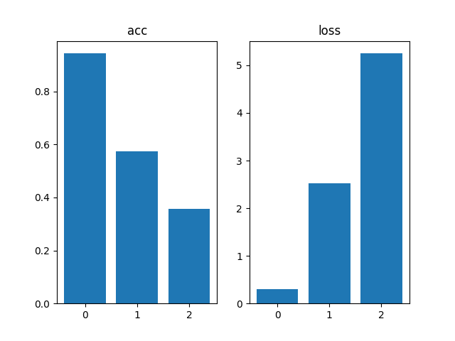

#### RGB

acc
| count/眼镜 | 1 | 5 | 6 |
| --------: | -: | -: | -: |
| 1 | 0.9294605851173401 | 0.5443037748336792 | 0.09210526198148727 |
| 2 | 0.8787878751754761 | 0.6129032373428345 | 0.19696970283985138 |
| 3 | 0.9336016178131104 | 0.6233766078948975 | 0.07692307978868484 |
| 4 | 0.9504132270812988 | 0.594936728477478 | 0.13513512909412384 |
| 5 | 0.9321357011795044 | 0.5799999833106995 | 0.1230769231915474 |
| 6 | 0.9489796161651611 | 0.6399999856948853 | 0.10526315867900848 |
| 7 | 0.9571734666824341 | 0.6038960814476013 | 0.09473684430122375 |
| 8 | 0.9329268336296082 | 0.654321014881134 | 0.06451612710952759 |
| 9 | 0.9236947894096375 | 0.5945945978164673 | 0.1428571492433548 |
| 10 | 0.9460580945014954 | 0.5454545617103577 | 0.07246376574039459 |
| average | 0.9333231806755066 | 0.5993786573410034 | 0.1104047141969204 |

loss
| count/眼镜 | 1 | 5 | 6 |
| --------: | -: | -: | -: |
| 1 | 0.24256792664527893 | 1.9629151821136475 | 6.8578643798828125 |
| 2 | 0.4638546109199524 | 1.6823010444641113 | 5.069395065307617 |
| 3 | 0.2600482404232025 | 1.43081533908844 | 6.063082695007324 |
| 4 | 0.21816162765026093 | 1.616342544555664 | 4.1845784187316895 |
| 5 | 0.27224448323249817 | 1.694547176361084 | 5.8314409255981445 |
| 6 | 0.19619087874889374 | 1.381851315498352 | 3.8841307163238525 |
| 7 | 0.20132587850093842 | 1.6494500637054443 | 4.561709880828857 |
| 8 | 0.28268152475357056 | 1.4729324579238892 | 4.799480438232422 |
| 9 | 0.26377567648887634 | 1.7303192615509033 | 4.339154243469238 |
| 10 | 0.2077593356370926 | 1.758067011833191 | 4.5530900955200195 |
| average | 0.2608610183000565 | 1.6379541397094726 | 5.014392685890198 |

作图如下
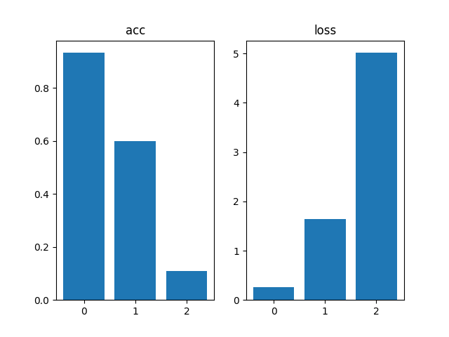
